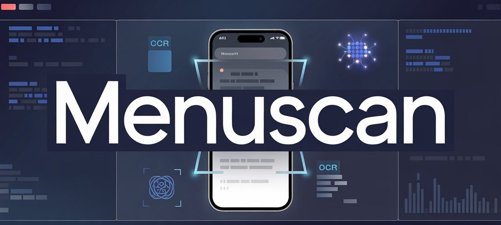

<p align="center">
  
</p>

<h1 align="center">MenuScan</h1>

<p align="center">
  Scan a foreign or unfamiliar menu and get a personalized dining assistant:
  each dish is translated, explained, and matched against your own diet — so you
  know what it is, whether it suits you, and why.
</p>

<p align="center">
  <strong>Menu Image -> OCR + AI -> Structured Menu -> Personalized Advice</strong>
</p>

<p align="center">
  
  
  
  
  
</p>

---

# Overview

MenuScan is a **personalized dining assistant** for travelers and people who are
particular about what they eat. Point your camera at a menu in a language you
don't read — or full of dishes you don't recognize — and MenuScan turns it into
clear, personalized guidance.

A plain translation app gives you the *words*. MenuScan gives you a *judgment*:
for every dish it reads the menu, translates it, infers likely ingredients, and
compares them against **your saved profile** — allergies, diet, likes and
dislikes — to tell you whether a dish fits you, why, and what to watch out for
(for example, "may contain shrimp" or "ask for less sugar").

Under the hood this is powered by an OCR + LLM pipeline that converts messy menu
photos into clean, structured data — the same core that makes the personalized
advice possible.

> [!IMPORTANT]
> **MenuScan is a reference assistant, not a safety guarantee.** Dish suggestions
> and allergy flags are AI-inferred from menu text and can be wrong or incomplete
> — hidden ingredients (sauces, oils, spices, cross-contamination) cannot be
> detected from a photo. Always confirm with restaurant staff before eating,
> especially for serious allergies.

The agreed MVP scope and business rules are documented in
[MenuScan MVP Contract](doc/content/mvp-contract.md).

---

# Features

- **Menu Image Upload**  
  Upload a menu photo or PDF (single or multi-page) for automated processing.

- **OCR & AI Analysis**  
  Detect text, menu sections, prices, item names, descriptions, and layout
  context, then infer likely ingredients, allergens, and dietary tags per dish.

- **Structured Menu Extraction**  
  Convert unstructured visual menu content into predictable digital records with
  per-field confidence scores.

- **Dietary Profile**  
  Save your allergies, diet (e.g. vegetarian, halal), and food likes/dislikes
  once, from a fixed taxonomy, and reuse them on every scan.

- **Personalized Dish Advice**  
  Each dish gets a per-user verdict — *recommended for you* / *maybe* /
  *avoid* — with a short reason, plus allergy and preference flags. Matching
  dishes are ranked to the top.

- **Group Dining (planned)**  
  Create a dining group, share it by QR, let each member fill in their own
  profile without logging in, and split the bill by headcount.

- **API-Ready Output**  
  Structured JSON suitable for backend storage, integrations, and frontend
  rendering.

---

# Contributors

<a href="https://github.com/DACNPMTT/MenuScan/graphs/contributors">
  
</a>

---

# System Workflow

```text
Menu Image
   ↓
OCR & AI Analysis
   ↓
Menu Extraction (structured dishes + inferred dietary metadata)
   ↓
Personalization (match dishes against the diner's profile)
   ↓
Personalized Result (ranked dishes + per-dish advice)
```

## Workflow Details

1. **Menu Image**  
   A menu is uploaded as an image or document.

2. **OCR & AI Analysis**  
   The system extracts text and analyzes visual structure, grouping related
   content into dishes.

3. **Menu Extraction**  
   Dish names, descriptions, prices, and inferred metadata (ingredients,
   allergens, dietary tags) are identified and normalized. This step is
   **profile-agnostic** so its result can be cached and reused.

4. **Personalization**  
   The structured menu is matched against the diner's saved profile. A separate
   advisor step produces a per-dish verdict, reason, and flags — without
   re-running OCR.

5. **Personalized Result**  
   Dishes that fit are ranked to the top and labelled; risky dishes are flagged
   with a reason.

---

# Architecture

MenuScan is designed as a modular application with clear ownership boundaries between the frontend, API, AI pipeline, and data store.

```text
Client Application
   ↓
Backend API
   ↓
AI Processing Layer
   ↓
Structured Data Store
```

## Architectural Principles

- **Frontend-first workflow clarity**  
  The React frontend is organized around product features and reusable shared components.

- **Backend API boundary**  
  The Python backend is responsible for request handling, processing orchestration, validation, and data delivery.

- **AI processing isolation**  
  OCR and AI extraction logic can evolve independently from the API and UI layers.

- **Structured output contract**  
  Extracted menu data follows a predictable JSON shape for integration and review.

- **Deployment-ready separation**  
  Infrastructure, documentation, app code, and frontend code are kept in dedicated directories.

---

# Tech Stack

| Layer              | Technology                 | Purpose                                           |
| ------------------ | -------------------------- | ------------------------------------------------- |
| Frontend           | React                      | Interactive web application                       |
| Frontend Build     | Vite                       | Fast development and production bundling          |
| Language           | TypeScript                 | Type-safe frontend development                    |
| Backend            | Python                     | API and AI processing orchestration               |
| Package Management | npm, uv                    | Frontend and Python dependency management         |
| AI Processing      | OCR + LLM pipeline         | Menu text extraction and structuring              |
| Documentation      | Markdown                   | Architecture, database, and product documentation |
| Infrastructure     | Docker / deployment config | Future production deployment support              |

---

# Screenshots

## Dashboard

<p align="center">
  
</p>

## Menu Upload Flow

<p align="center">
  
</p>

## Structured Menu Output

<p align="center">
  
</p>

---

# Project Structure

```text
MenuScan/
├── app/
│   ├── main.py
│   ├── pyproject.toml
│   ├── uv.lock
│   ├── Dockerfile.dev
│   └── README.md
│
├── frontend/
│   ├── public/
│   ├── src/
│   │   ├── app/
│   │   │   ├── providers/
│   │   │   └── routes/
│   │   ├── features/
│   │   │   └── menu-scan/
│   │   ├── layouts/
│   │   ├── pages/
│   │   ├── shared/
│   │   │   ├── components/
│   │   │   ├── hooks/
│   │   │   └── lib/
│   │   └── styles/
│   ├── package.json
│   ├── Dockerfile.dev
│   ├── vite.config.ts
│   └── README.md
│
├── doc/
│   └── ai/
│       ├── architecture.md
│       ├── database.md
│       └── frontend.md
│
├── infras/
├── .github/
├── env/                    ← Local environment templates
├── docker-compose.yml      ← Local DB/Redis dependencies
├── Makefile                ← Local task runner
├── .gitignore
└── README.md
```

---

# Getting Started

## Prerequisites

- Docker Desktop for local dependency containers.
- GNU Make. On Windows, use Git Bash, WSL, or another GNU Make installation.
- Python 3.12+ and [uv](https://docs.astral.sh/uv/) for the backend.
- Node.js 22+ and npm for the frontend.

## Quick Start

```bash
git clone https://github.com/DACNPMTT/MenuScan.git
cd MenuScan
make env ENV=local
make install-be
make install-fe
make deps ENV=local
```

Run the backend and frontend in separate terminals:

```bash
make backend ENV=local
make frontend ENV=local
```

Open:

| Service  | URL                            |
| -------- | ------------------------------ |
| Frontend | `http://localhost:5173`        |
| Backend  | `http://localhost:8000`        |
| Health   | `http://localhost:8000/health` |
| Database | `localhost:5432`               |
| Redis    | `localhost:6379`               |

> Redis is provisioned by Compose but **no application code uses it**. Rate
> limiting runs as an atomic upsert into the Postgres `ai_throttle` table
> (`app/src/core/rate_limit.py`), so Postgres is the only runtime datastore.

## Dev Commands

`Makefile` is the canonical local task runner. The root `docker-compose.yml`
only starts development dependencies; backend and frontend run natively.

```bash
make env ENV=local        # Create env/.env.local from env/.env.local.example
make deps ENV=local       # Start Postgres and Redis
make deps-down ENV=local  # Stop local dependency containers
make deps-reset ENV=local # Recreate dependencies and remove volumes
make deps-logs ENV=local  # Tail dependency logs
make deps-ps ENV=local    # Show dependency container status
make backend ENV=local    # Run migrations, then start FastAPI
make frontend ENV=local   # Start Vite
make migrate ENV=local    # Apply Alembic migrations
make test-be ENV=local    # Run backend tests
make lint                 # Run backend and frontend lint
```

## Environment Files

Local environment templates live in `env/`. Real env files such as
`env/.env.local` are gitignored.

```bash
make env ENV=local
```

The local defaults point the backend at Postgres on `localhost:5432` and Redis
on `localhost:6379`.

## Compose and CI/CD

The root `docker-compose.yml` is intentionally limited to local dependency
containers. The `infras/` directory is reserved for full-container or future
CI/CD deployment compose configuration.

---

# API Examples

## Upload Menu Image

```http
POST /api/v1/scans
Content-Type: multipart/form-data
Authorization: Bearer <access_token>
```

### Example Request

```bash
curl -X POST http://127.0.0.1:8000/api/v1/scans \
  -H "Authorization: Bearer <access_token>" \
  -F "file=@menu.jpg" \
  -F "target_language=en"
```

### Example Response

```json
{
  "success": true,
  "data": {
    "id": "71151f64-39c7-4419-810a-c0835bafe341",
    "status": "PENDING",
    "source": {
      "file_name": "menu.jpg",
      "mime_type": "image/jpeg",
      "file_size": 2458912
    },
    "target_language": "en"
  },
  "meta": null
}
```

---

# Roadmap

**Now — personalization core (current focus)**

- Dietary profile: allergies, diet, likes/dislikes from a fixed taxonomy.
- Per-dish ingredient/flavor inference for preference matching.
- Advisor step: per-user verdict (recommended / maybe / avoid) + reason.
- Result screen: rank matching dishes, keep allergy/preference flags.
- Bilingual UI (Vietnamese / English) for all new screens.

**Next**

- In-menu chat assistant ("is this spicy?", "what's in this?").
- Group dining: create group, QR share, per-member profiles without login,
  headcount-based bill split.

**Later**

- Scan history and saved menus.
- Automated image preprocessing for low-quality photos.
- Export structured menus to CSV / JSON.
- Production hardening (rate limiting, monitoring, audit log).

---
