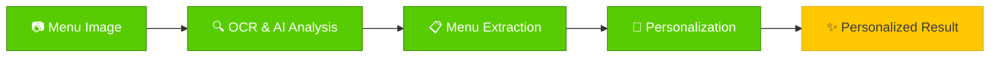
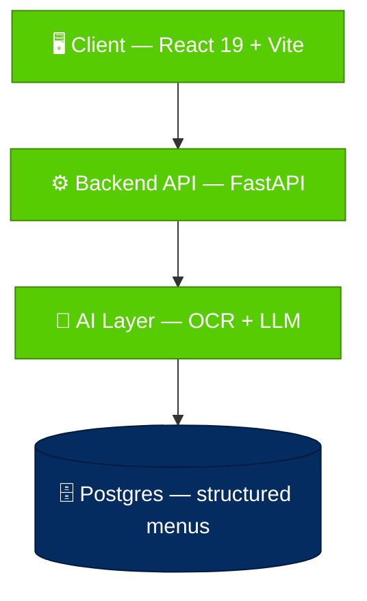

<p align="center">
  
</p>

<h1 align="center">MenuScan</h1>

<p align="center">
  <b>Scan an unfamiliar menu → get a personalized dining assistant.</b><br />
  Every dish is translated, explained, and matched against your own diet — so you
  know what it is, whether it suits you, and why.
</p>

<p align="center">
  📷 <b>Menu Image</b> &nbsp;→&nbsp; 🔍 <b>OCR + AI</b> &nbsp;→&nbsp; 📋 <b>Structured Menu</b> &nbsp;→&nbsp; ✨ <b>Personalized Advice</b>
</p>

<p align="center">
  
  
  
  
  
  
</p>

<p align="center">
  <a href="#overview">Overview</a> &nbsp;·&nbsp;
  <a href="#features">Features</a> &nbsp;·&nbsp;
  <a href="#architecture">Architecture</a> &nbsp;·&nbsp;
  <a href="#getting-started">Getting Started</a> &nbsp;·&nbsp;
  <a href="#roadmap">Roadmap</a>
</p>

---

## Overview

MenuScan is a **personalized dining assistant** for travelers and people who are
particular about what they eat. Point your camera at a menu in a language you
don't read — or full of dishes you don't recognize — and MenuScan turns it into
clear, personalized guidance.

A plain translation app gives you the *words*. MenuScan gives you a *judgment*:
for every dish it reads the menu, translates it, infers likely ingredients, and
compares them against **your saved profile** — allergies, diet, likes and
dislikes — to tell you whether a dish fits you, why, and what to watch out for
(for example, "may contain shrimp" or "ask for less sugar").

Under the hood this is powered by an OCR + LLM pipeline that converts messy menu
photos into clean, structured data — the same core that makes the personalized
advice possible.

> [!IMPORTANT]
> **MenuScan is a reference assistant, not a safety guarantee.** Dish suggestions
> and allergy flags are AI-inferred from menu text and can be wrong or incomplete
> — hidden ingredients (sauces, oils, spices, cross-contamination) cannot be
> detected from a photo. Always confirm with restaurant staff before eating,
> especially for serious allergies.

The agreed MVP scope and business rules are documented in
[MenuScan MVP Contract](doc/content/mvp-contract.md).

---

## Features

| | Feature | What it does |
|---|---|---|
| 📷 | **Menu Image Upload** | Upload a menu photo or PDF (single or multi-page) for automated processing. |
| 🔍 | **OCR & AI Analysis** | Detect text, sections, prices, names, descriptions and layout, then infer likely ingredients, allergens, and dietary tags per dish. |
| 📋 | **Structured Extraction** | Convert unstructured visual menus into predictable digital records with per-field confidence scores. |
| 👤 | **Dietary Profile** | Save allergies, diet (vegetarian, halal…), and food likes/dislikes once, from a fixed taxonomy, and reuse them on every scan. |
| ✨ | **Personalized Advice** | Each dish gets a per-user verdict — *recommended* / *maybe* / *avoid* — with a short reason plus allergy & preference flags. Matches rank to the top. |
| 👥 | **Group Dining** *(planned)* | Create a dining group, share by QR, let members fill their own profile without login, and split the bill by headcount. |
| 🔌 | **API-Ready Output** | Structured JSON suitable for backend storage, integrations, and frontend rendering. |

---

## System Workflow



<details>
<summary><b>Step-by-step details</b></summary>

1. **Menu Image** — a menu is uploaded as an image or document.
2. **OCR & AI Analysis** — the system extracts text and analyzes visual
   structure, grouping related content into dishes.
3. **Menu Extraction** — dish names, descriptions, prices, and inferred metadata
   (ingredients, allergens, dietary tags) are identified and normalized. This
   step is **profile-agnostic**, so its result can be cached and reused.
4. **Personalization** — the structured menu is matched against the diner's saved
   profile. A separate advisor step produces a per-dish verdict, reason, and
   flags — without re-running OCR.
5. **Personalized Result** — dishes that fit are ranked to the top and labelled;
   risky dishes are flagged with a reason.

</details>

---

## Architecture

MenuScan is a modular application with clear ownership boundaries between the
frontend, API, AI pipeline, and data store.



**Principles**

- **Frontend-first clarity** — the React app is organized around product features
  and reusable shared components.
- **Backend API boundary** — the Python backend owns request handling, processing
  orchestration, validation, and data delivery.
- **AI processing isolation** — OCR and AI extraction evolve independently from
  the API and UI layers.
- **Structured output contract** — extracted data follows a predictable JSON
  shape for integration and review.
- **Deployment-ready separation** — infrastructure, docs, app, and frontend live
  in dedicated directories.

---

## Tech Stack

| Layer | Technology | Purpose |
|---|---|---|
| Frontend | React 19 + TypeScript | Type-safe interactive web app |
| Build | Vite 8 | Fast dev server and production bundling |
| Backend | Python 3.12 + FastAPI | API and AI processing orchestration |
| AI Pipeline | OCR + LLM (Google Vision + Gemini) | Menu text extraction and structuring |
| Data | PostgreSQL | Structured menu + profile storage |
| Packaging | npm · uv | Frontend and Python dependency management |
| Infra & CI/CD | Docker · GitHub Actions · Cloud Run · Terraform | Build, test, deploy, and infrastructure as code |

---

## Screenshots

<table>
  <tr>
    <td align="center" width="33%"><b>Dashboard</b><br /></td>
    <td align="center" width="33%"><b>Menu Upload</b><br /></td>
    <td align="center" width="33%"><b>Structured Output</b><br /></td>
  </tr>
</table>

---

## Project Structure

```text
MenuScan/
├── app/                    # FastAPI backend + AI pipeline
│   ├── main.py
│   ├── pyproject.toml · uv.lock
│   └── Dockerfile.dev
├── frontend/               # React 19 + Vite app
│   └── src/{app,features,layouts,pages,shared,styles}
├── infras/
│   ├── docker-compose.yml  # full-container stack
│   └── terraform/          # GCP platform layer (IaC)
├── load-test/              # k6 load tests
├── doc/                    # architecture, design, devops docs
├── .github/                # CI/CD workflows + composite actions
├── env/                    # local environment templates
├── docker-compose.yml      # local DB/Redis dependencies
├── Makefile                # local task runner
└── README.md
```

---

## Getting Started

### Prerequisites

- **Docker Desktop** for local dependency containers.
- **GNU Make** — on Windows use Git Bash, WSL, or another GNU Make install.
- **Python 3.12+** and [uv](https://docs.astral.sh/uv/) for the backend.
- **Node.js 22+** and npm for the frontend.

### Quick Start

```bash
git clone https://github.com/DACNPMTT/MenuScan.git
cd MenuScan
make env ENV=local
make install-be
make install-fe
make deps ENV=local
```

Run the backend and frontend in separate terminals:

```bash
make backend ENV=local     # migrations, then FastAPI
make frontend ENV=local    # Vite dev server
```

Then open:

| Service | URL |
|---|---|
| 🖥️ Frontend | `http://localhost:5173` |
| ⚙️ Backend | `http://localhost:8000` |
| ❤️ Health | `http://localhost:8000/health` |
| 🗄️ Database | `localhost:5432` |
| 🧰 Redis | `localhost:6379` |

> [!NOTE]
> Redis is provisioned by Compose but **no application code uses it**. Rate
> limiting runs as an atomic upsert into the Postgres `ai_throttle` table
> ([`app/src/core/rate_limit.py`](app/src/core/rate_limit.py)), so Postgres is
> the only runtime datastore.

### Dev Commands

`Makefile` is the canonical local task runner. The root `docker-compose.yml`
only starts development dependencies; backend and frontend run natively.

```bash
make env ENV=local        # Create env/.env.local from the example
make deps ENV=local       # Start Postgres and Redis
make deps-down ENV=local  # Stop local dependency containers
make deps-reset ENV=local # Recreate dependencies and remove volumes
make backend ENV=local    # Run migrations, then start FastAPI
make frontend ENV=local   # Start Vite
make migrate ENV=local    # Apply Alembic migrations
make test-be ENV=local    # Run backend tests
make lint                 # Run backend and frontend lint
```

### Environment Files

Local templates live in `env/`; real files such as `env/.env.local` are
gitignored. The local defaults point the backend at Postgres on `localhost:5432`
and Redis on `localhost:6379`.

### Compose & CI/CD

The root `docker-compose.yml` is limited to local dependency containers.
`infras/docker-compose.yml` holds the full-container stack, and
`infras/terraform/` holds the Terraform for the GCP platform layer.

CI/CD lives in `.github/workflows/` (orchestrators `ci.yml` / `cd.yml` calling
reusable workflows, with shared setup in `.github/actions/`) — covering build,
test, security scanning, and zero-downtime deploys to Cloud Run.

---

## API Examples

**Upload a menu image**

```http
POST /api/v1/scans
Content-Type: multipart/form-data
Authorization: Bearer <access_token>
```

```bash
curl -X POST http://127.0.0.1:8000/api/v1/scans \
  -H "Authorization: Bearer <access_token>" \
  -F "file=@menu.jpg" \
  -F "target_language=en"
```

```json
{
  "success": true,
  "data": {
    "id": "71151f64-39c7-4419-810a-c0835bafe341",
    "status": "PENDING",
    "source": {
      "file_name": "menu.jpg",
      "mime_type": "image/jpeg",
      "file_size": 2458912
    },
    "target_language": "en"
  },
  "meta": null
}
```

---

## Roadmap

**🟢 Now — personalization core (current focus)**

- Dietary profile: allergies, diet, likes/dislikes from a fixed taxonomy.
- Per-dish ingredient/flavor inference for preference matching.
- Advisor step: per-user verdict (recommended / maybe / avoid) + reason.
- Result screen: rank matching dishes, keep allergy/preference flags.
- Bilingual UI (Vietnamese / English) for all new screens.

**🟡 Next**

- In-menu chat assistant ("is this spicy?", "what's in this?").
- Group dining: create group, QR share, per-member profiles without login,
  headcount-based bill split.

**⚪ Later**

- Scan history and saved menus.
- Automated image preprocessing for low-quality photos.
- Export structured menus to CSV / JSON.
- Production hardening (rate limiting, monitoring, audit log).

---

## Contributors

<a href="https://github.com/DACNPMTT/MenuScan/graphs/contributors">
  
</a>

---

<p align="center">
  <sub>Built with 💚 by the MenuScan team · Licensed under MIT</sub>
</p>
