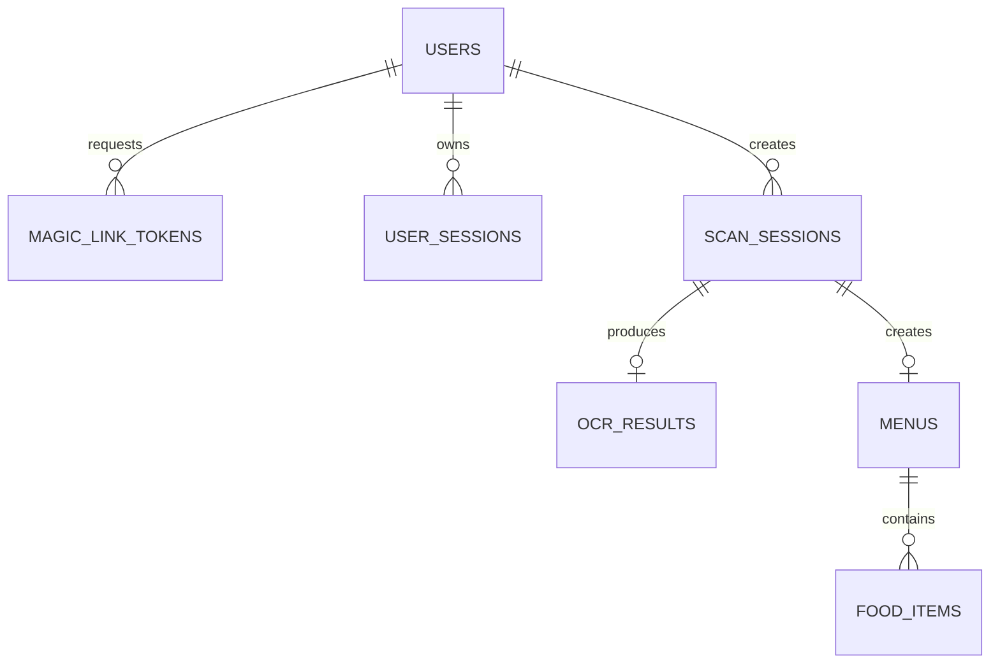

# MenuScan Database Context

> Chỉ đọc cho task model/table/repository/transaction/ownership/migration/cache.
> Schema source of truth: `doc/content/specification/database.md`.
> `DB/schema.sql` là schema Sprint 0 cũ, không dùng cho implementation MVP.

PostgreSQL 16 là source of truth và chỉ backend truy cập. Redis chỉ cache hoặc
coordination; frontend/provider không kết nối trực tiếp database/cache.

## Relationships

## Ownership map

| Table / model | Module | Repository | Write workflow |
| --- | --- | --- | --- |
| `users` / `User` | `identity` | `UserRepository` | verify Magic Link, approved profile/admin |
| `magic_link_tokens` / `MagicLinkToken` | `identity` | `MagicLinkTokenRepository` | request/verify Magic Link |
| `user_sessions` / `UserSession` | `identity` | `UserSessionRepository` | verify, refresh, logout/revoke |
| `scan_sessions` / `ScanSession` | `menu_scan` | `ScanSessionRepository` | create/process scan |
| `ocr_results` / `OcrResult` | `menu_scan` | `OcrResultRepository` | OCR processing |
| `menus` / `Menu` | `menu` | `MenuRepository` | finish scan, save menu |
| `food_items` / `FoodItem` | `menu` | `FoodItemRepository` | finish scan |

Tên class là boundary đề xuất; không tạo class/interface trống nếu task chưa cần.
Module không query table owner khác qua repository riêng của nó.

## Persistence boundaries

| Object | Được làm | Không được làm |
| --- | --- | --- |
| SQLAlchemy model | map table, relationship, constraint | workflow nhiều bước, HTTP/provider call |
| Repository | named query, add/flush, owner-scoped lookup | tự commit tùy ý, business workflow, HTTP response |
| Service | business validation, authorization, transaction, adapter orchestration | truyền session/query/lazy model lên router |
| Router/schema | validate input, gọi service, map public response | query ORM trực tiếp, lộ hash/internal metadata |
| Worker | gọi service/repository boundary với ID/idempotency | raw SQL bypass workflow, serialize ORM object |

Repository method phải thể hiện intent (`get_owned_scan`, `consume_valid_token`),
không dùng generic CRUD base che query. Service commit/rollback; external email,
storage hoặc OCR không chạy trong transaction mở nếu có thể tách pha.

## Transaction invariants

| Workflow | Tables | Bắt buộc atomic |
| --- | --- | --- |
| Request Magic Link | `magic_link_tokens`, đọc `users` | cooldown + invalidate token cũ |
| Verify Magic Link | `magic_link_tokens`, `users`, `user_sessions` | consume một lần + create user/session |
| Refresh | `user_sessions` | rotate hash; reuse thì revoke family |
| Create scan | `scan_sessions` | chỉ sau auth + metadata hợp lệ |
| Finish scan | `scan_sessions`, `ocr_results`, `menus`, `food_items` | guarded terminal transition; menu có item |
| Save menu | `menus`, đọc owner qua scan/user | `is_saved` + `saved_at` nhất quán |

Contract yêu cầu phát hiện refresh-token reuse và revoke session family, nhưng
database specification hiện chưa có field biểu diễn family/token lineage. Task
triển khai refresh phải bổ sung migration/specification rõ trước khi code; không
tự giả định reuse detection đã được schema hỗ trợ.

## Access and query rules

- Scope owner ngay trong query theo `users -> scan_sessions -> menus -> food_items`.
- Không mặc định expose `ocr_results.raw_text`, provider metadata, hash hoặc
  soft-delete fields.
- Collection dùng stable ordering/pagination; tránh N+1 khi load menu items.
- Query thường loại soft-deleted row; delete user phải revoke session.

## Redis

Redis chưa tích hợp. Khi thêm: adapter nằm trong module/core cache; key có
namespace + version + owner scope + TTL; không cache raw token/file/secret hoặc
cross-user response. Chỉ invalidate sau DB mutation thành công; cache error
fallback PostgreSQL khi semantics cho phép. Lock/rate-limit dùng atomic operation
+ TTL; DB constraint/transaction vẫn bảo vệ invariant cuối cùng.

## Schema change gate

Xác định owner + consumer + API impact; tạo migration/rollback; cập nhật model,
schema mapping, repository, service và test; kiểm tra constraint/index/old data/
cache invalidation; cập nhật specification khi contract hoặc invariant thay đổi.
