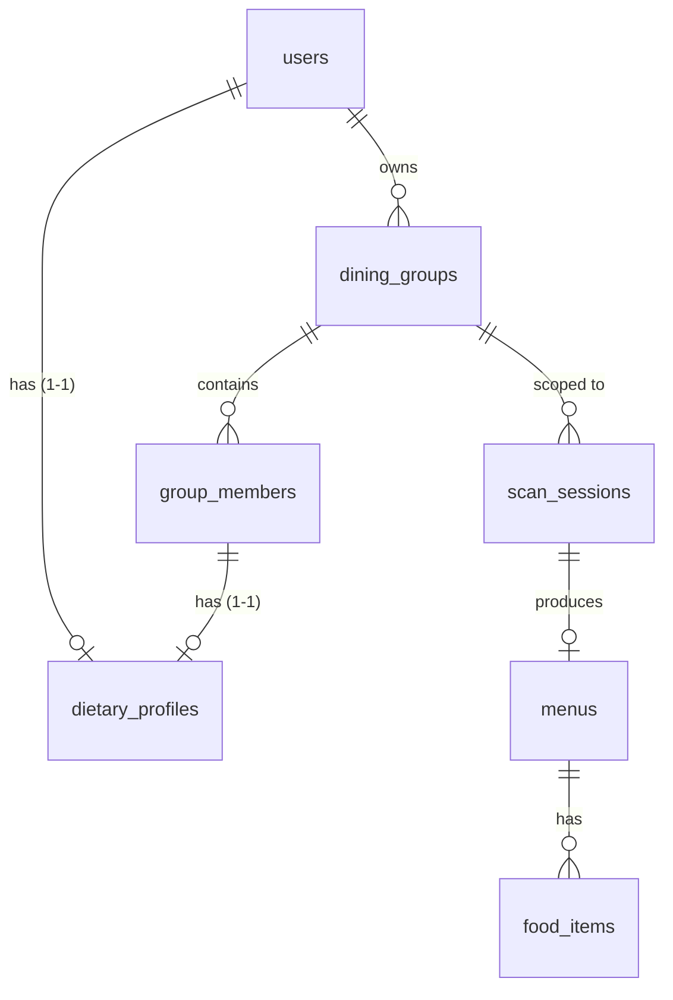

# Đề xuất: Cá nhân hoá & Nhóm ăn uống (Personalization)

> Trạng thái: **DRAFT — chờ duyệt**
> Phạm vi: 5 tính năng liên quan tới cá nhân hoá kết quả scan menu, hồ sơ ăn
> uống, nhóm và QR chia bill.

## 1. Mục tiêu

1. **Trợ lý tự nhiên** — AI trả lời về menu như một trợ lý thật (hội thoại),
   không chỉ trả JSON.
2. **Hồ sơ ăn uống** — thêm *sở thích*, *dị ứng*, *ghét ăn* (dị ứng đã có).
3. **Gợi ý món** — sau khi scan, đề xuất và đưa món hợp khẩu vị lên đầu.
4. **Nhóm ăn uống** — một "bản nhóm" chứa hồ sơ ăn uống của từng thành viên.
5. **QR nhóm** — thành viên quét QR điền hồ sơ trước khi scan; tự đếm số người
   đã điền để chia bill.

## 2. Hiện trạng (đã có trong dự án)

| Thành phần | Vị trí | Ghi chú |
|---|---|---|
| `users.allergies`, `users.dietary_preferences` (`text[]`) | `identity/models.py` | Hồ sơ ăn kiêng cơ bản đã có |
| `food_items.allergens`, `food_items.dietary_tags` (`text[]`) | `menu/models.py` | LLM suy ra mỗi món |
| Taxonomy dị ứng / chế độ ăn | `identity/schemas.py`, `pipeline.py` | Bộ mã cố định |
| Đối chiếu món ↔ hồ sơ (`assessDish`) | `frontend/.../dietary.ts` | Chỉ **cảnh báo** rủi ro, chưa xếp hạng |
| Chia bill đều N người | `billing/service.py::split_bill` | Tổng khớp tuyệt đối |
| Scan guest (không đăng nhập) | `scan_sessions.user_id` nullable | Nền cho luồng QR |
| LLM trích xuất JSON | `menu_scan/llm_menu_parser.py` | `responseSchema`, không hội thoại |

**Còn thiếu:** trường *sở thích* / *ghét ăn*; nhãn nguyên liệu trên món để khớp
sở thích; xếp hạng gợi ý; module nhóm; QR; lớp trợ lý hội thoại.

## 3. Quyết định thiết kế đã chốt

- **Tách hồ sơ ăn uống ra một bảng riêng** `dietary_profiles` (dùng chung cho cả
  `users` và `group_members`), thay vì để cột trực tiếp trên `users`.
- **favorites / dislikes dùng mã cố định** (controlled taxonomy), không phải text
  tự do — để khớp chính xác với nhãn nguyên liệu của món.
- API vẫn trả 4 trường **phẳng** trên object user (`allergies`,
  `dietary_preferences`, `favorites`, `dislikes`) → frontend gần như không đổi
  cấu trúc.

## 4. Thiết kế dữ liệu

### 4.1. Bảng hồ sơ ăn uống dùng chung

```sql
CREATE TABLE dietary_profiles (
    id                   uuid PRIMARY KEY DEFAULT gen_random_uuid(),
    allergies            text[] NOT NULL DEFAULT '{}',  -- dị ứng
    dietary_preferences  text[] NOT NULL DEFAULT '{}',  -- chế độ ăn
    favorites            text[] NOT NULL DEFAULT '{}',  -- sở thích  (MỚI)
    dislikes             text[] NOT NULL DEFAULT '{}',  -- ghét ăn   (MỚI)
    created_at           timestamptz NOT NULL DEFAULT now(),
    updated_at           timestamptz NOT NULL DEFAULT now()
);
```

Chủ sở hữu trỏ tới hồ sơ qua FK 1-1 (tạo lười khi khai lần đầu):

```sql
ALTER TABLE users
    ADD COLUMN dietary_profile_id uuid UNIQUE
    REFERENCES dietary_profiles(id) ON DELETE SET NULL;
-- group_members (mục 4.4) dùng đúng FK này.
```

> Giữ kiểu `text[]` để đồng bộ toàn bộ code hiện có. Phương án chuẩn hoá hẳn
> (mỗi mã một dòng) bị loại vì phải viết lại mọi chỗ đọc/ghi mảng và không còn
> là "một bảng".

### 4.2. Taxonomy (bộ mã cố định)

Giữ nguyên hai bộ đã có:

- `ALLERGEN_CODES` = seafood, shellfish, fish, peanut, tree_nut, egg, dairy,
  gluten, soy, sesame
- `DIETARY_PREFERENCE_CODES` = vegetarian, vegan, no_pork, no_beef, no_alcohol

Thêm **một bộ mã "vị & nguyên liệu"** dùng chung cho `favorites`, `dislikes` và
`food_items.ingredients` (danh sách cuối cùng sẽ chốt khi implement, cấu trúc cố
định):

- `TASTE_TAGS` (vị / cách chế biến): `spicy`, `sweet`, `sour`, `salty`, `umami`,
  `grilled`, `fried`, `steamed`, `soup`, `raw`, `stir_fried`
- `INGREDIENT_TAGS` (nguyên liệu chính): `beef`, `pork`, `chicken`, `duck`,
  `seafood`, `shrimp`, `fish`, `crab`, `squid`, `egg`, `tofu`, `mushroom`,
  `noodle`, `rice`, `vegetable`, `cheese`, `cilantro`, `onion`, `garlic`,
  `offal`, `chili`

`favorites` và `dislikes` chỉ nhận mã trong `TASTE_TAGS ∪ INGREDIENT_TAGS`.

### 4.3. Nhãn nguyên liệu cho món (phục vụ khớp sở thích)

```sql
ALTER TABLE food_items
    ADD COLUMN ingredients text[] NOT NULL DEFAULT '{}';
```

LLM điền `ingredients` từ cùng bộ `TASTE_TAGS ∪ INGREDIENT_TAGS` (thêm 1 dòng
vào prompt + `responseSchema` trong `llm_menu_parser.py`, lọc mã lạ ở
`pipeline.py::_clean_tags` như `allergens`/`dietary_tags` đang làm).

### 4.4. Nhóm ăn uống

```sql
CREATE TABLE dining_groups (
    id           uuid PRIMARY KEY DEFAULT gen_random_uuid(),
    owner_id     uuid REFERENCES users(id) ON DELETE SET NULL,  -- người tạo
    name         varchar(150),
    share_token  varchar(64) NOT NULL UNIQUE,   -- dùng cho URL/QR
    status       varchar(20) NOT NULL DEFAULT 'OPEN', -- OPEN | CLOSED
    created_at   timestamptz NOT NULL DEFAULT now(),
    expires_at   timestamptz
);

CREATE TABLE group_members (
    id                  uuid PRIMARY KEY DEFAULT gen_random_uuid(),
    group_id            uuid NOT NULL REFERENCES dining_groups(id) ON DELETE CASCADE,
    user_id             uuid REFERENCES users(id) ON DELETE SET NULL, -- null = guest
    display_name        varchar(150) NOT NULL,
    dietary_profile_id  uuid REFERENCES dietary_profiles(id) ON DELETE SET NULL,
    joined_at           timestamptz NOT NULL DEFAULT now()
);
CREATE INDEX ix_group_members_group_id ON group_members(group_id);
```

Liên kết scan với nhóm:

```sql
ALTER TABLE scan_sessions
    ADD COLUMN group_id uuid REFERENCES dining_groups(id) ON DELETE SET NULL;
```

**Hồ sơ nhóm** = hợp (union) của `allergies` và `dislikes` mọi thành viên (để
cảnh báo/loại), còn `favorites` dùng để cộng điểm gợi ý theo tần suất.

### 4.5. Sơ đồ quan hệ



## 5. Kế hoạch migration

Một revision Alembic mới nối tiếp `e5f6a7b8c9d0`:

1. `CREATE TABLE dietary_profiles`; `ALTER TABLE users ADD dietary_profile_id`.
2. **Backfill**: mỗi user có `allergies`/`dietary_preferences` khác rỗng → tạo
   một `dietary_profiles`, copy dữ liệu, gán FK.
3. `ALTER TABLE users DROP COLUMN allergies, DROP COLUMN dietary_preferences`.
4. `ALTER TABLE food_items ADD COLUMN ingredients`.
5. `CREATE TABLE dining_groups`, `group_members`; `ALTER TABLE scan_sessions ADD group_id`.
6. `downgrade()` làm ngược lại (thêm lại cột, copy về, drop bảng).

Đồng bộ tay `DB/schema.sql` và `doc/content/specification/database.md`.

## 6. Thay đổi backend

### 6.1. Hồ sơ ăn uống (mục 2)
- `identity/models.py`: bỏ 2 cột khỏi `User`, thêm quan hệ tới `DietaryProfile`;
  đặt model `DietaryProfile` ở module dùng chung để `group` tái sử dụng.
- `identity/service.py::update_user_profile`: ghi vào hàng profile (tạo nếu
  chưa có), thêm `favorites`/`dislikes`.
- `identity/schemas.py`: `UpdateUserProfileRequest`, `UserResponse`,
  `UserMeResponse` thêm `favorites`/`dislikes` + validator theo bộ mã mới; map
  phẳng từ `user.dietary_profile`.
- `identity/repository.py`: eager-load `dietary_profile` (tránh N+1).

### 6.2. Gợi ý món (mục 3)
- Tính **điểm cá nhân hoá** lúc gọi API (không lưu cứng, vì phụ thuộc người
  dùng/nhóm):
  - Loại/cảnh báo: `allergies ∩ allergens`, vi phạm `dietary_preferences`
    (tái dùng logic `assessDish`).
  - Cộng điểm: `favorites ∩ (ingredients ∪ taste)`.
  - Trừ điểm: `dislikes ∩ ingredients`.
- Endpoint mới `GET /menus/{id}/recommendations` (hoặc tham số `sort=recommended`
  cho endpoint kết quả), trả danh sách đã xếp hạng + lý do.

### 6.3. Trợ lý hội thoại (mục 1)
- Adapter mới `GeminiChat` tái dùng pattern httpx + key-pool của
  `GeminiMenuParser`, **bỏ `responseSchema`**, prompt = danh sách món + hồ sơ ăn
  uống, trả văn xuôi (nên stream).
- Endpoint `POST /menus/{id}/assistant` (nhận câu hỏi, trả lời tự nhiên; ưu tiên
  gợi ý hợp khẩu vị, tránh món rủi ro).

### 6.4. Nhóm + QR (mục 4–5)
- Module mới `group`: `models.py`, `schemas.py`, `service.py`, `repository.py`,
  `router.py`.
- Endpoints:
  - `POST /groups` — tạo nhóm, sinh `share_token`, trả URL tham gia.
  - `GET /groups/{token}` — thông tin nhóm để render form/QR.
  - `POST /groups/{token}/members` — thành viên (kể cả guest) điền hồ sơ → tạo
    `group_member` + `dietary_profiles`.
  - `GET /groups/{token}/members` — liệt kê + **đếm số người đã điền**.
- QR render ở **frontend** từ URL tham gia (không cần thư viện backend).

### 6.5. Chia bill theo nhóm (mục 5)
- `billing/service.py::split_bill` đã chia đều N người → chỉ cần **nối** số
  thành viên đã điền của nhóm vào `people_count` (mặc định, vẫn cho sửa tay).

## 7. Thay đổi frontend

- **Profile/Onboarding**: thêm mục *sở thích* và *ghét ăn* (chọn từ mã cố định),
  mở rộng `DietPreferencePicker` + i18n vi/en.
- **Kết quả scan**: xếp lại thứ tự theo điểm gợi ý, gắn nhãn "Gợi ý cho bạn" và
  cảnh báo rủi ro (mở rộng `assessDish` → `scoreDish`).
- **Trợ lý**: khung chat trong `MenuDetailPage`.
- **Nhóm**: trang tạo nhóm + hiển thị QR; trang form thành viên điền hồ sơ (mở
  từ link QR, không cần đăng nhập); màn đếm số người tham gia; nút chia bill lấy
  headcount từ nhóm.

## 8. Thứ tự triển khai đề xuất

1. **Nền dữ liệu** — bảng `dietary_profiles` (tách + backfill), `favorites`/
   `dislikes`, `food_items.ingredients`, cập nhật prompt LLM. *(Rủi ro thấp,
   mở khoá các mục sau.)*
2. **Gợi ý món** — scoring + endpoint + UI xếp hạng.
3. **Trợ lý hội thoại** — adapter + endpoint + chat UI.
4. **Nhóm + QR + chia bill** — module `group`, luồng QR, nối headcount.

## 9. Điểm cần quyết định / rủi ro

- **Chốt danh sách mã** `TASTE_TAGS` / `INGREDIENT_TAGS` cuối cùng (cân bằng độ
  phủ vs. độ chính xác khớp).
- **Chất lượng nhãn `ingredients`** phụ thuộc LLM — cần vài mẫu kiểm thử.
- **Bảo mật `share_token`**: token đủ ngẫu nhiên, có `expires_at`; guest chỉ ghi
  được hồ sơ của chính mình.
- **Quyền riêng tư**: hồ sơ ăn uống của guest gắn với nhóm, nên có TTL/tự xoá
  sau khi nhóm đóng.
```
