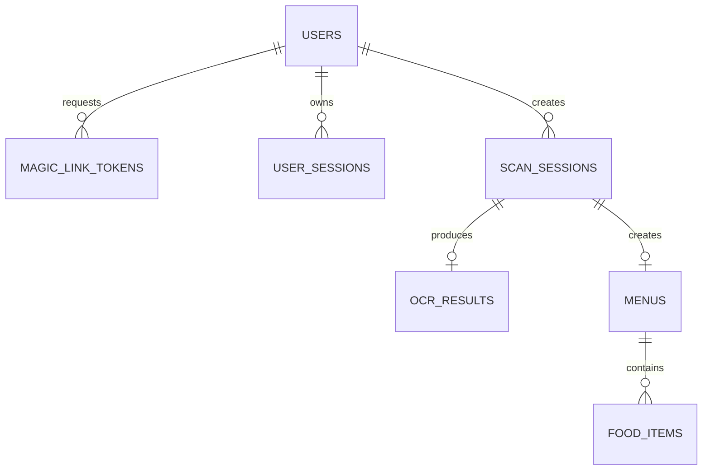

# MenuScan MVP Database Specification

> Nguồn nghiệp vụ chuẩn: [MenuScan MVP Contract](../mvp-contract.md)
> Đây là specification cho task database/migration; `DB/schema.sql` cũ chưa
> phải schema MVP đã chốt.

## 1. Quy ước

- PostgreSQL 16.
- Table/column dùng `snake_case`.
- Primary key dùng UUID.
- Thời gian dùng `TIMESTAMPTZ`, lưu UTC.
- Tiền dùng `NUMERIC(14,2)`.
- Email unique theo `LOWER(email)`.
- Magic Link token và refresh token chỉ lưu hash.
- Access token không lưu trong database.
- File nhị phân lưu ở Object Storage; database chỉ lưu object key và metadata.

## 2. Quan hệ

## 3. Enum

| Enum | Giá trị |
| --- | --- |
| `user_role` | `USER`, `ADMIN` |
| `user_status` | `ACTIVE`, `LOCKED`, `DISABLED` |
| `scan_status` | `PENDING`, `PROCESSING`, `COMPLETED`, `FAILED` |

## 4. Bảng MVP

### 4.1 `users`

| Cột | Kiểu | Ràng buộc |
| --- | --- | --- |
| `id` | UUID | PK |
| `email` | VARCHAR(255) | NOT NULL |
| `display_name` | VARCHAR(150) | NULL |
| `preferred_language` | VARCHAR(10) | NOT NULL, default `vi`, check `vi/en` |
| `role` | `user_role` | NOT NULL, default `USER` |
| `status` | `user_status` | NOT NULL, default `ACTIVE` |
| `created_at` | TIMESTAMPTZ | NOT NULL |
| `updated_at` | TIMESTAMPTZ | NOT NULL |
| `deleted_at` | TIMESTAMPTZ | NULL |

Index bắt buộc: unique `uq_users_email_lower` trên `LOWER(email)`.

User được tạo tự động khi Magic Link được xác minh lần đầu.

### 4.2 `magic_link_tokens`

| Cột | Kiểu | Ràng buộc |
| --- | --- | --- |
| `id` | UUID | PK |
| `email` | VARCHAR(255) | NOT NULL |
| `user_id` | UUID | FK `users.id`, NULL trước lần xác minh đầu |
| `token_hash` | VARCHAR(255) | NOT NULL, UNIQUE |
| `expires_at` | TIMESTAMPTZ | NOT NULL |
| `consumed_at` | TIMESTAMPTZ | NULL |
| `created_at` | TIMESTAMPTZ | NOT NULL |

Quy tắc:

- `expires_at = created_at + 15 phút`.
- Token hợp lệ khi chưa consumed và chưa hết hạn.
- Sau verify phải cập nhật `consumed_at` trong cùng transaction tạo session.
- Có index `(email, created_at DESC)` để kiểm soát cooldown 60 giây.

### 4.3 `user_sessions`

| Cột | Kiểu | Ràng buộc |
| --- | --- | --- |
| `id` | UUID | PK |
| `user_id` | UUID | FK `users.id`, NOT NULL, cascade |
| `refresh_token_hash` | VARCHAR(255) | NOT NULL, UNIQUE |
| `user_agent` | TEXT | NULL |
| `ip_address` | INET | NULL |
| `expires_at` | TIMESTAMPTZ | NOT NULL |
| `revoked_at` | TIMESTAMPTZ | NULL |
| `created_at` | TIMESTAMPTZ | NOT NULL |
| `last_rotated_at` | TIMESTAMPTZ | NOT NULL |

Refresh session sống tối đa 30 ngày. Mỗi lần refresh phải rotate token trong
transaction; token cũ không còn hợp lệ.

### 4.4 `scan_sessions`

| Cột | Kiểu | Ràng buộc |
| --- | --- | --- |
| `id` | UUID | PK |
| `user_id` | UUID | FK `users.id`, NOT NULL |
| `source_object_key` | TEXT | NOT NULL |
| `source_file_name` | VARCHAR(255) | NOT NULL |
| `source_mime_type` | VARCHAR(100) | NOT NULL, check MIME MVP |
| `source_file_size` | BIGINT | NOT NULL, `1..10485760` |
| `source_page_count` | SMALLINT | NOT NULL, default `1`, `1..5` |
| `target_language` | VARCHAR(10) | NOT NULL, check `vi/en` |
| `status` | `scan_status` | NOT NULL, default `PENDING` |
| `stage` | VARCHAR(30) | NULL |
| `progress` | SMALLINT | NOT NULL, default `0`, `0..100` |
| `error_code` | VARCHAR(100) | NULL |
| `error_message` | TEXT | NULL |
| `created_at` | TIMESTAMPTZ | NOT NULL |
| `started_at` | TIMESTAMPTZ | NULL |
| `completed_at` | TIMESTAMPTZ | NULL |
| `deleted_at` | TIMESTAMPTZ | NULL |

MIME check:

- `image/jpeg`
- `image/png`
- `image/webp`
- `application/pdf`

Khi `FAILED`, `error_code` bắt buộc có giá trị. Khi `COMPLETED`, `completed_at`
bắt buộc có giá trị. User chỉ truy cập scan thuộc `user_id` của mình.

### 4.5 `ocr_results`

| Cột | Kiểu | Ràng buộc |
| --- | --- | --- |
| `id` | UUID | PK |
| `scan_session_id` | UUID | FK, NOT NULL, UNIQUE, cascade |
| `raw_text` | TEXT | NOT NULL |
| `detected_language` | VARCHAR(10) | NULL |
| `confidence_score` | NUMERIC(5,4) | NULL, `0..1` |
| `provider` | VARCHAR(50) | NULL |
| `provider_metadata` | JSONB | NOT NULL, default `{}` |
| `processing_time_ms` | INTEGER | NULL, `>=0` |
| `created_at` | TIMESTAMPTZ | NOT NULL |

`provider_metadata` không được chứa API key, access token hoặc secret.

### 4.6 `menus`

| Cột | Kiểu | Ràng buộc |
| --- | --- | --- |
| `id` | UUID | PK |
| `scan_session_id` | UUID | FK, NOT NULL, UNIQUE, cascade |
| `title` | VARCHAR(255) | NOT NULL |
| `source_language` | VARCHAR(10) | NULL |
| `target_language` | VARCHAR(10) | NOT NULL |
| `default_currency` | CHAR(3) | NULL |
| `is_saved` | BOOLEAN | NOT NULL, default `FALSE` |
| `saved_at` | TIMESTAMPTZ | NULL |
| `created_at` | TIMESTAMPTZ | NOT NULL |
| `updated_at` | TIMESTAMPTZ | NOT NULL |

`saved_at` có giá trị khi `is_saved=true`.

### 4.7 `food_items`

| Cột | Kiểu | Ràng buộc |
| --- | --- | --- |
| `id` | UUID | PK |
| `menu_id` | UUID | FK, NOT NULL, cascade |
| `original_name` | VARCHAR(255) | NOT NULL |
| `translated_name` | VARCHAR(255) | NULL |
| `original_description` | TEXT | NULL |
| `translated_description` | TEXT | NULL |
| `price` | NUMERIC(14,2) | NULL, `>=0` |
| `currency` | CHAR(3) | NULL |
| `category` | VARCHAR(100) | NULL |
| `confidence_score` | NUMERIC(5,4) | NULL, `0..1` |
| `sort_order` | INTEGER | NOT NULL, `>=0` |
| `created_at` | TIMESTAMPTZ | NOT NULL |
| `updated_at` | TIMESTAMPTZ | NOT NULL |

Unique `(menu_id, sort_order)`. MVP không lưu `image_url` cho từng món; giao
diện dùng file gốc của `scan_sessions`.

## 5. Quy tắc toàn vẹn

1. Guest không tạo `scan_sessions`.
2. Một scan có tối đa một OCR result và một menu.
3. Scan `COMPLETED` phải có menu và ít nhất một food item.
4. Chỉ hash token được lưu.
5. File source không public; API kiểm tra owner trước khi tạo signed URL.
6. Giá không nhận diện được lưu `NULL`, không tự mặc định `0`.
7. Xóa user phải thu hồi session; dữ liệu nghiệp vụ dùng soft delete.

## 6. Phạm vi Sprint 2

Các bảng cho chỉnh sửa menu, dashboard analytics, order, service fee, split và
digital receipt không thuộc migration Sprint 1. Chúng phải được thiết kế trong
task Sprint 2 tương ứng và không làm thay đổi contract auth/scan ở trên.
