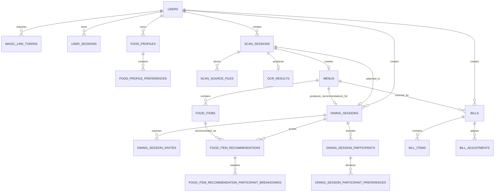

# MenuScan Database Specification

> Nguồn nghiệp vụ chuẩn: [MenuScan MVP Contract](../mvp-contract.md)
> Schema thực thi hiện hành là toàn bộ Alembic history trong
> `app/alembic/versions/`. Migration là nguồn sự thật duy nhất; không duy trì
> schema SQL thủ công song song.
> Tài liệu này mô tả schema tại migration head `e8b5d3f07a24` — **19 bảng nghiệp
> vụ + 1 bảng hạ tầng (`ai_throttle`)**. Toàn bộ bảng ở đây đã được triển khai
> bằng migration, kể cả nhóm dining/recommendation.

## 1. Quy ước

- PostgreSQL 16.
- Table/column dùng `snake_case`.
- Primary key dùng UUID.
- Thời gian dùng `TIMESTAMPTZ`, lưu UTC.
- Tiền dùng `NUMERIC(14,2)`.
- Email unique theo `LOWER(email)`.
- Magic Link token và refresh token chỉ lưu hash.
- Access token không lưu trong database.
- File nhị phân lưu ở Object Storage; database chỉ lưu object key và metadata.

## 2. Quan hệ

`ai_throttle` (mục 4.19) không xuất hiện trong sơ đồ trên: nó là bảng hạ tầng
chống spam, không có foreign key và không tham gia quan hệ nghiệp vụ nào.

## 3. Enum

| Enum | Giá trị |
| --- | --- |
| `user_role` | `USER`, `ADMIN` |
| `user_status` | `ACTIVE`, `LOCKED`, `DISABLED` |
| `scan_status` | `PENDING`, `PROCESSING`, `COMPLETED`, `FAILED` |
| `menu_status` | `DRAFT`, `CONFIRMED` |
| `bill_status` | `DRAFT`, `FINALIZED` |
| `bill_adjustment_type` | `DISCOUNT`, `SURCHARGE`, `TAX`, `SERVICE_CHARGE`, `ROUNDING` |
| `bill_adjustment_calculation_type` | `FIXED`, `PERCENTAGE` |
| `dining_session_mode` | `PERSONAL`, `GROUP` |
| `dining_session_status` | `COLLECTING`, `SCANNING`, `COMPLETED`, `CLOSED` |
| `preference_type` | `LIKE`, `DISLIKE`, `AVOID`, `ALLERGY`, `DIETARY_RULE` |
| `recommendation_verdict` | `RECOMMENDED`, `OK`, `CAUTION`, `AVOID` |

## 4. Bảng nghiệp vụ

### 4.1 `users`

| Cột | Kiểu | Ràng buộc |
| --- | --- | --- |
| `id` | UUID | PK |
| `email` | VARCHAR(255) | NOT NULL |
| `password_hash` | VARCHAR(255) | NULL |
| `display_name` | VARCHAR(150) | NULL |
| `preferred_language` | VARCHAR(10) | NOT NULL, default `vi`, check `vi/en` |
| `allergies` | TEXT[] | NOT NULL, default `{}` |
| `dietary_preferences` | TEXT[] | NOT NULL, default `{}` |
| `role` | `user_role` | NOT NULL, default `USER` |
| `status` | `user_status` | NOT NULL, default `ACTIVE` |
| `created_at` | TIMESTAMPTZ | NOT NULL |
| `updated_at` | TIMESTAMPTZ | NOT NULL |
| `deleted_at` | TIMESTAMPTZ | NULL |

Index bắt buộc: unique `uq_users_email_lower` trên `LOWER(email)`.

User được tạo tự động khi Magic Link được xác minh lần đầu.

### 4.2 `magic_link_tokens`

| Cột | Kiểu | Ràng buộc |
| --- | --- | --- |
| `id` | UUID | PK |
| `email` | VARCHAR(255) | NOT NULL |
| `user_id` | UUID | FK `users.id`, NULL trước lần xác minh đầu |
| `token_hash` | VARCHAR(255) | NOT NULL, UNIQUE |
| `expires_at` | TIMESTAMPTZ | NOT NULL |
| `consumed_at` | TIMESTAMPTZ | NULL |
| `created_at` | TIMESTAMPTZ | NOT NULL |

Quy tắc:

- `expires_at = created_at + 15 phút`.
- Token hợp lệ khi chưa consumed và chưa hết hạn.
- Sau verify phải cập nhật `consumed_at` trong cùng transaction tạo session.
- Có index `(email, created_at DESC)` để kiểm soát cooldown 60 giây.

### 4.3 `user_sessions`

| Cột | Kiểu | Ràng buộc |
| --- | --- | --- |
| `id` | UUID | PK |
| `user_id` | UUID | FK `users.id`, NOT NULL, cascade |
| `refresh_token_hash` | VARCHAR(255) | NOT NULL, UNIQUE |
| `user_agent` | TEXT | NULL |
| `ip_address` | INET | NULL |
| `expires_at` | TIMESTAMPTZ | NOT NULL |
| `revoked_at` | TIMESTAMPTZ | NULL |
| `created_at` | TIMESTAMPTZ | NOT NULL |
| `last_rotated_at` | TIMESTAMPTZ | NOT NULL |

Refresh session sống tối đa 30 ngày. Mỗi lần refresh phải rotate token trong
transaction; token cũ không còn hợp lệ.

### 4.4 `scan_sessions`

| Cột | Kiểu | Ràng buộc |
| --- | --- | --- |
| `id` | UUID | PK |
| `user_id` | UUID | FK `users.id`, NULL cho guest scan |
| `source_object_key` | TEXT | NOT NULL |
| `source_file_name` | VARCHAR(255) | NOT NULL |
| `source_mime_type` | VARCHAR(100) | NOT NULL, check MIME MVP |
| `source_file_size` | BIGINT | NOT NULL, `1..10485760` |
| `source_page_count` | SMALLINT | NOT NULL, default `1`, `1..8` |
| `target_language` | VARCHAR(10) | NOT NULL, check language-tag regex |
| `status` | `scan_status` | NOT NULL, default `PENDING` |
| `stage` | VARCHAR(30) | NULL |
| `progress` | SMALLINT | NOT NULL, default `0`, `0..100` |
| `error_code` | VARCHAR(100) | NULL |
| `error_message` | TEXT | NULL |
| `created_at` | TIMESTAMPTZ | NOT NULL |
| `started_at` | TIMESTAMPTZ | NULL |
| `completed_at` | TIMESTAMPTZ | NULL |
| `deleted_at` | TIMESTAMPTZ | NULL |

MIME check:

- `image/jpeg`
- `image/png`
- `image/webp`
- `application/pdf`

Khi `FAILED`, `error_code` bắt buộc có giá trị. Khi `COMPLETED`, `completed_at`
bắt buộc có giá trị. Scan có `user_id` chỉ owner truy cập; scan guest có
`user_id = NULL` và truy cập bằng `scan_id`.

### 4.4.1 `scan_source_files`

| Cột | Kiểu | Ràng buộc |
| --- | --- | --- |
| `id` | UUID | PK |
| `scan_session_id` | UUID | FK `scan_sessions.id`, NOT NULL, cascade |
| `object_key` | TEXT | NOT NULL |
| `file_name` | VARCHAR(255) | NOT NULL |
| `mime_type` | VARCHAR(100) | NOT NULL, check MIME MVP |
| `file_size` | BIGINT | NOT NULL, `1..10485760` |
| `page_count` | SMALLINT | NOT NULL, default `1` |
| `sort_order` | SMALLINT | NOT NULL, `>=0` |
| `created_at` | TIMESTAMPTZ | NOT NULL |

`scan_sessions.source_*` giữ file đầu tiên để tương thích preview/history;
`scan_source_files` giữ toàn bộ source file theo thứ tự upload để pipeline OCR
tất cả và merge thành một `OcrDocument`.

### 4.5 `ocr_results`

| Cột | Kiểu | Ràng buộc |
| --- | --- | --- |
| `id` | UUID | PK |
| `scan_session_id` | UUID | FK, NOT NULL, UNIQUE, cascade |
| `raw_text` | TEXT | NOT NULL |
| `detected_language` | VARCHAR(10) | NULL |
| `confidence_score` | NUMERIC(5,4) | NULL, `0..1` |
| `provider` | VARCHAR(50) | NULL |
| `provider_metadata` | JSONB | NOT NULL, default `{}` |
| `processing_time_ms` | INTEGER | NULL, `>=0` |
| `created_at` | TIMESTAMPTZ | NOT NULL |

`provider_metadata` không được chứa API key, access token hoặc secret.

### 4.6 `menus`

| Cột | Kiểu | Ràng buộc |
| --- | --- | --- |
| `id` | UUID | PK |
| `scan_session_id` | UUID | FK, NOT NULL, UNIQUE, cascade |
| `title` | VARCHAR(255) | NOT NULL |
| `source_language` | VARCHAR(10) | NULL |
| `target_language` | VARCHAR(10) | NOT NULL, check language-tag regex |
| `default_currency` | CHAR(3) | NULL |
| `is_saved` | BOOLEAN | NOT NULL, default `FALSE` |
| `status` | `menu_status` | NOT NULL, default `DRAFT` |
| `saved_at` | TIMESTAMPTZ | NULL |
| `deleted_at` | TIMESTAMPTZ | NULL |
| `created_at` | TIMESTAMPTZ | NOT NULL |
| `updated_at` | TIMESTAMPTZ | NOT NULL |

`saved_at` có giá trị khi `is_saved=true`.

### 4.7 `food_items`

| Cột | Kiểu | Ràng buộc |
| --- | --- | --- |
| `id` | UUID | PK |
| `menu_id` | UUID | FK, NOT NULL, cascade |
| `original_name` | VARCHAR(255) | NOT NULL |
| `translated_name` | VARCHAR(255) | NULL |
| `original_description` | TEXT | NULL |
| `translated_description` | TEXT | NULL |
| `assistant_summary` | TEXT | NULL |
| `main_ingredients` | TEXT[] | NOT NULL, default `{}` |
| `ingredient_tags` | TEXT[] | NOT NULL, default `{}` |
| `flavor_tags` | TEXT[] | NOT NULL, default `{}` |
| `texture_tags` | TEXT[] | NOT NULL, default `{}` |
| `cooking_methods` | TEXT[] | NOT NULL, default `{}` |
| `spice_level` | SMALLINT | NULL, `0..5` |
| `sweetness_level` | SMALLINT | NULL, `0..5` |
| `saltiness_level` | SMALLINT | NULL, `0..5` |
| `sourness_level` | SMALLINT | NULL, `0..5` |
| `richness_level` | SMALLINT | NULL, `0..5` |
| `oiliness_level` | SMALLINT | NULL, `0..5` |
| `risk_notes` | TEXT | NULL |
| `price` | NUMERIC(14,2) | NULL, `>=0` |
| `currency` | CHAR(3) | NULL |
| `category` | VARCHAR(100) | NULL |
| `allergens` | TEXT[] | NOT NULL, default `{}` |
| `dietary_tags` | TEXT[] | NOT NULL, default `{}` |
| `confidence_score` | NUMERIC(5,4) | NULL, `0..1` |
| `sort_order` | INTEGER | NOT NULL, `>=0` |
| `created_at` | TIMESTAMPTZ | NOT NULL |
| `updated_at` | TIMESTAMPTZ | NOT NULL |

Unique `(menu_id, sort_order)`. MVP không lưu `image_url` cho từng món; giao
diện dùng file gốc của `scan_sessions`.

Các cột `assistant_summary`, `main_ingredients`, `flavor_tags`,
`cooking_methods` và các `*_level` là dữ liệu khách quan do AI suy luận để item
menu hoạt động như trợ lý chọn món: món này làm từ gì, vị thế nào, chế biến ra
sao, cay/ngọt/béo/dầu ở mức nào và có rủi ro chung gì. Kết quả phù hợp với
người dùng/nhóm không lưu trực tiếp ở `food_items` vì cùng một món có thể hợp
người này nhưng không hợp người khác.

### 4.8 `food_profiles`

| Cột | Kiểu | Ràng buộc |
| --- | --- | --- |
| `id` | UUID | PK |
| `user_id` | UUID | FK `users.id`, NOT NULL, cascade |
| `display_name` | VARCHAR(150) | NOT NULL |
| `preferred_language` | VARCHAR(10) | NOT NULL, check language-tag regex |
| `is_default` | BOOLEAN | NOT NULL, default `FALSE` |
| `notes` | TEXT | NULL |
| `created_at` | TIMESTAMPTZ | NOT NULL |
| `updated_at` | TIMESTAMPTZ | NOT NULL |
| `deleted_at` | TIMESTAMPTZ | NULL |

`food_profiles` lưu profile ăn uống lâu dài của user đăng nhập. Một user có thể
có nhiều profile, nhưng mỗi user chỉ nên có một profile mặc định chưa bị xóa.
Profile này dùng cho flow cá nhân hoặc làm nguồn copy preference vào một phiên
ăn/chọn món.

Index đề xuất:

- `ix_food_profiles_user_id`
- unique partial `(user_id) WHERE is_default = true AND deleted_at IS NULL`

### 4.9 `food_profile_preferences`

| Cột | Kiểu | Ràng buộc |
| --- | --- | --- |
| `id` | UUID | PK |
| `food_profile_id` | UUID | FK `food_profiles.id`, NOT NULL, cascade |
| `code` | VARCHAR(80) | NOT NULL |
| `category` | VARCHAR(40) | NOT NULL |
| `preference_type` | `preference_type` | NOT NULL |
| `intensity` | SMALLINT | NULL, `0..5` |
| `importance` | SMALLINT | NOT NULL, default `3`, `1..5` |
| `note` | TEXT | NULL |
| `created_at` | TIMESTAMPTZ | NOT NULL |

Ví dụ `code`: `spicy`, `seafood`, `fish_sauce`, `oily`, `sweet`, `beef`,
`pork`, `peanut`. `category` phân nhóm như `taste`, `ingredient`, `allergen`,
`cooking`, `dietary`. `preference_type` phân biệt thích, không thích, tránh,
dị ứng hoặc luật ăn kiêng.

Unique đề xuất: `(food_profile_id, code, preference_type)`.

### 4.10 `dining_sessions`

| Cột | Kiểu | Ràng buộc |
| --- | --- | --- |
| `id` | UUID | PK |
| `created_by_user_id` | UUID | FK `users.id`, NULL cho guest |
| `scan_session_id` | UUID | FK `scan_sessions.id`, NULL trước khi scan, UNIQUE |
| `menu_id` | UUID | FK `menus.id`, NULL trước khi scan hoàn tất, UNIQUE |
| `mode` | `dining_session_mode` | NOT NULL |
| `status` | `dining_session_status` | NOT NULL, default `COLLECTING` |
| `target_language` | VARCHAR(10) | NOT NULL, check language-tag regex |
| `created_at` | TIMESTAMPTZ | NOT NULL |
| `updated_at` | TIMESTAMPTZ | NOT NULL |
| `completed_at` | TIMESTAMPTZ | NULL |
| `closed_at` | TIMESTAMPTZ | NULL |
| `deleted_at` | TIMESTAMPTZ | NULL |

`dining_sessions` là context dùng để AI recommend. Kể cả flow cá nhân cũng tạo
session ngầm với `mode = PERSONAL`, một participant và không có invite QR. Flow
nhóm dùng `mode = GROUP`, tạo invite QR và nhiều participant. Session được tạo
trước khi scan; sau khi scan xong mới cập nhật `scan_session_id` và `menu_id`.

### 4.11 `dining_session_invites`

| Cột | Kiểu | Ràng buộc |
| --- | --- | --- |
| `id` | UUID | PK |
| `dining_session_id` | UUID | FK `dining_sessions.id`, NOT NULL, cascade |
| `token_hash` | VARCHAR(255) | NOT NULL, UNIQUE |
| `expires_at` | TIMESTAMPTZ | NULL |
| `revoked_at` | TIMESTAMPTZ | NULL |
| `max_uses` | INTEGER | NULL, `>0` |
| `use_count` | INTEGER | NOT NULL, default `0`, `>=0` |
| `created_at` | TIMESTAMPTZ | NOT NULL |

QR code chứa raw invite token trong URL; database chỉ lưu hash. Invite hợp lệ
khi chưa hết hạn, chưa bị revoke và chưa vượt `max_uses` nếu có cấu hình.

### 4.12 `dining_session_participants`

| Cột | Kiểu | Ràng buộc |
| --- | --- | --- |
| `id` | UUID | PK |
| `dining_session_id` | UUID | FK `dining_sessions.id`, NOT NULL, cascade |
| `user_id` | UUID | FK `users.id`, NULL |
| `display_name` | VARCHAR(150) | NOT NULL |
| `preferred_language` | VARCHAR(10) | NOT NULL, check language-tag regex |
| `joined_at` | TIMESTAMPTZ | NOT NULL |
| `left_at` | TIMESTAMPTZ | NULL |

Mỗi người quét QR tạo một participant trong session, không bắt buộc tài khoản.
Nếu participant là user đã đăng nhập thì `user_id` có thể được lưu để truy vết,
nhưng recommendation luôn dùng snapshot trong
`dining_session_participant_preferences`.

### 4.13 `dining_session_participant_preferences`

| Cột | Kiểu | Ràng buộc |
| --- | --- | --- |
| `id` | UUID | PK |
| `participant_id` | UUID | FK `dining_session_participants.id`, NOT NULL, cascade |
| `code` | VARCHAR(80) | NOT NULL |
| `category` | VARCHAR(40) | NOT NULL |
| `preference_type` | `preference_type` | NOT NULL |
| `intensity` | SMALLINT | NULL, `0..5` |
| `importance` | SMALLINT | NOT NULL, default `3`, `1..5` |
| `note` | TEXT | NULL |
| `created_at` | TIMESTAMPTZ | NOT NULL |

Đây là bản snapshot preference dùng cho đúng session hiện tại. Với user đăng
nhập, app có thể copy từ `food_profile_preferences`; với guest/quét QR, app lưu
trực tiếp các lựa chọn họ nhập. Sau khi đã copy vào session, việc user sửa
profile cá nhân không làm thay đổi recommendation của session cũ.

Unique đề xuất: `(participant_id, code, preference_type)`.

### 4.14 `food_item_recommendations`

| Cột | Kiểu | Ràng buộc |
| --- | --- | --- |
| `id` | UUID | PK |
| `dining_session_id` | UUID | FK `dining_sessions.id`, NOT NULL, cascade |
| `food_item_id` | UUID | FK `food_items.id`, NOT NULL, cascade |
| `verdict` | `recommendation_verdict` | NOT NULL |
| `score` | NUMERIC(5,2) | NULL, `0..100` |
| `explanation` | TEXT | NULL |
| `why_suitable` | TEXT | NULL |
| `why_not_suitable` | TEXT | NULL |
| `suggested_for` | TEXT[] | NOT NULL, default `{}` |
| `warning_for` | TEXT[] | NOT NULL, default `{}` |
| `fit_reasons` | TEXT[] | NOT NULL, default `{}` |
| `risk_reasons` | TEXT[] | NOT NULL, default `{}` |
| `warning_reasons` | TEXT[] | NOT NULL, default `{}` |
| `confidence_score` | NUMERIC(5,4) | NULL, `0..1` |
| `created_at` | TIMESTAMPTZ | NOT NULL |

Recommendation được tạo trong cùng pipeline scan/menu, sau khi AI nhận toàn bộ
participant preferences của `dining_session`. Bảng này trả lời câu hỏi "món này
có hợp với session cá nhân/nhóm hiện tại không, vì sao". Không lưu kết quả này
trực tiếp trên `food_items` vì recommendation phụ thuộc vào từng session.

Unique bắt buộc: `(dining_session_id, food_item_id)`.

### 4.15 `food_item_recommendation_participant_breakdowns`

| Cột | Kiểu | Ràng buộc |
| --- | --- | --- |
| `id` | UUID | PK |
| `food_item_recommendation_id` | UUID | FK `food_item_recommendations.id`, NOT NULL, cascade |
| `participant_id` | UUID | FK `dining_session_participants.id`, NOT NULL, cascade |
| `verdict` | `recommendation_verdict` | NOT NULL |
| `score` | NUMERIC(5,2) | NULL, `0..100` |
| `explanation` | TEXT | NULL |
| `fit_reasons` | TEXT[] | NOT NULL, default `{}` |
| `risk_reasons` | TEXT[] | NOT NULL, default `{}` |
| `created_at` | TIMESTAMPTZ | NOT NULL |

Bảng này dùng cho UI cần giải thích theo từng người: món này hợp ai, không hợp
ai, và vì sao. Có thể chưa bắt buộc ở MVP đầu tiên nếu UI chỉ cần
`suggested_for` / `warning_for` ở `food_item_recommendations`, nhưng nên có để
giữ dữ liệu giải thích ổn định.

Unique bắt buộc: `(food_item_recommendation_id, participant_id)`.

### 4.16 `bills`

| Cột | Kiểu | Ràng buộc |
| --- | --- | --- |
| `id` | UUID | PK |
| `user_id` | UUID | FK `users.id`, NOT NULL, RESTRICT |
| `menu_id` | UUID | FK `menus.id`, NOT NULL, RESTRICT |
| `status` | `bill_status` | NOT NULL, default `DRAFT` |
| `currency` | CHAR(3) | NOT NULL |
| `subtotal_amount` | NUMERIC(14,2) | NOT NULL, default `0`, `>=0` |
| `adjustment_total` | NUMERIC(14,2) | NOT NULL, default `0` |
| `total_amount` | NUMERIC(14,2) | NOT NULL, default `0`, `>=0` |
| `note` | TEXT | NULL |
| `created_at` | TIMESTAMPTZ | NOT NULL |
| `updated_at` | TIMESTAMPTZ | NOT NULL |
| `finalized_at` | TIMESTAMPTZ | NULL |

`finalized_at` bắt buộc có giá trị khi `status = FINALIZED`. Bill `FINALIZED`
không cho phép sửa items hoặc adjustments.

### 4.17 `bill_items`

| Cột | Kiểu | Ràng buộc |
| --- | --- | --- |
| `id` | UUID | PK |
| `bill_id` | UUID | FK `bills.id`, NOT NULL, CASCADE |
| `food_item_id` | UUID | FK `food_items.id`, NULL, SET NULL |
| `name_snapshot` | VARCHAR(255) | NOT NULL |
| `unit_price_snapshot` | NUMERIC(14,2) | NOT NULL, `>=0` |
| `currency` | CHAR(3) | NOT NULL |
| `quantity` | INTEGER | NOT NULL, default `1`, `>0` |
| `line_total` | NUMERIC(14,2) | NOT NULL, `>=0` |
| `sort_order` | INTEGER | NOT NULL, `>=0` |
| `created_at` | TIMESTAMPTZ | NOT NULL |
| `updated_at` | TIMESTAMPTZ | NOT NULL |

`food_item_id` chỉ dùng để truy xuất nguồn gốc; `name_snapshot` và
`unit_price_snapshot` là giá trị tại thời điểm thêm vào bill.

### 4.18 `bill_adjustments`

| Cột | Kiểu | Ràng buộc |
| --- | --- | --- |
| `id` | UUID | PK |
| `bill_id` | UUID | FK `bills.id`, NOT NULL, CASCADE |
| `type` | `bill_adjustment_type` | NOT NULL |
| `label` | VARCHAR(255) | NOT NULL |
| `calculation_type` | `bill_adjustment_calculation_type` | NOT NULL, default `FIXED` |
| `value` | NUMERIC(14,2) | NOT NULL, `>=0` |
| `calculated_amount` | NUMERIC(14,2) | NOT NULL |
| `created_at` | TIMESTAMPTZ | NOT NULL |

`value` luôn không âm; `calculated_amount` có dấu (âm cho `DISCOUNT`, dương cho
các loại còn lại). Mỗi adjustment được tính độc lập từ `subtotal_amount`, không
cộng dồn trên running total. Khi `calculation_type = PERCENTAGE`, `value <= 100`.

### 4.19 `ai_throttle`

Bảng hạ tầng (không phải nghiệp vụ), định nghĩa tại `app/src/core/rate_limit.py`.
Chống spam các lời gọi tốn tiền vào AI (scan, chat).

| Cột | Kiểu | Ràng buộc |
| --- | --- | --- |
| `subject_type` | VARCHAR(8) | PK (composite), `user` hoặc `ip` |
| `subject_id` | VARCHAR(255) | PK (composite), user id hoặc địa chỉ IP |
| `action` | VARCHAR(16) | PK (composite), `scan` hoặc `chat` |
| `last_at` | TIMESTAMPTZ | NOT NULL, default `now()` |

PK là bộ ba `(subject_type, subject_id, action)` — mỗi subject có đúng một dòng
cho mỗi loại hành động, giữ nguyên mốc thời gian gọi gần nhất.

Đây **không** phải quota theo ngày, chỉ là khoảng cách tối thiểu giữa hai lời
gọi (`SCAN_MIN_GAP_SECONDS`, `CHAT_MIN_GAP_SECONDS`). Guest bị throttle theo IP,
user đã đăng nhập bị throttle theo user id.

Kiểm tra được thực hiện bằng **một upsert atomic duy nhất trong Postgres**, cùng
cơ chế với cooldown magic-link. Đây là lý do hệ thống **không cần Redis** — xem
`doc/ai/database.md`.

## 5. Quy tắc toàn vẹn

1. Guest được tạo `scan_sessions` với `user_id = NULL`.
2. Một scan có tối đa một OCR result và một menu.
3. Scan `COMPLETED` phải có menu; danh sách `food_items` có thể rỗng nếu parser không tìm được item chắc chắn.
4. Chỉ hash token được lưu.
5. File source không public; API kiểm tra owner trước khi tạo signed URL.
6. Giá không nhận diện được lưu `NULL`, không tự mặc định `0`.
7. Xóa user phải thu hồi session; dữ liệu nghiệp vụ dùng soft delete.
8. Bill `FINALIZED` không được sửa items hoặc adjustments.
9. Bill chỉ được tạo trên menu thuộc chính user đó.
10. `food_items` lưu thông tin khách quan của món; recommendation theo cá nhân/nhóm phải lưu ở `food_item_recommendations`.
11. Flow cá nhân vẫn tạo `dining_sessions` với `mode = PERSONAL`, một participant và không có invite QR.
12. Flow nhóm tạo `dining_sessions` với `mode = GROUP`; participant quét QR không bắt buộc có tài khoản.
13. AI recommendation dùng snapshot trong `dining_session_participant_preferences`, không đọc trực tiếp profile cá nhân sau khi session đã bắt đầu scan.
14. `dining_sessions.status = COMPLETED` phải có `scan_session_id`, `menu_id` và recommendation cho các món được AI đánh giá.
15. Invite token QR chỉ lưu dạng hash; raw token không lưu database.

## 6. Phạm vi mở rộng

Dashboard analytics, order, thanh toán online và các tính năng ngoài bảng hiện
tại phải được thiết kế bằng migration mới và cập nhật contract/auth/scan nếu làm
đổi hành vi.
