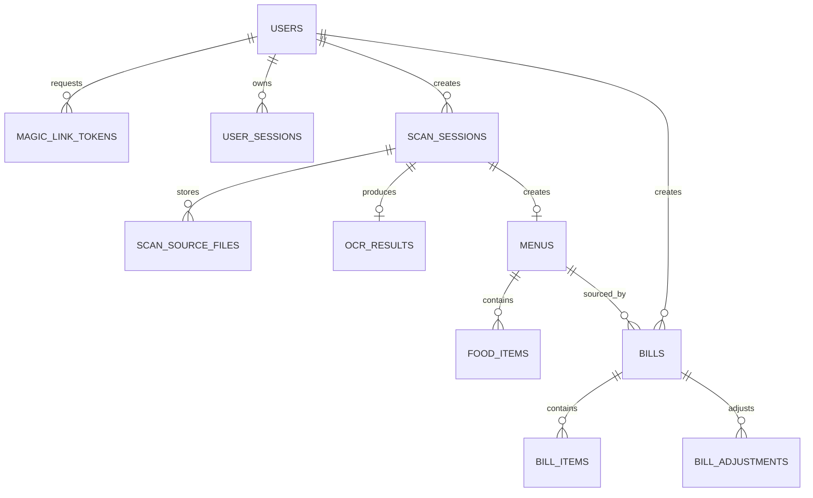

# MenuScan MVP Database Specification

> Nguồn nghiệp vụ chuẩn: [MenuScan MVP Contract](../mvp-contract.md)
> Schema thực thi hiện hành là toàn bộ Alembic history trong
> `app/alembic/versions/`. Migration là nguồn sự thật duy nhất; không duy trì
> schema SQL thủ công song song.

## 1. Quy ước

- PostgreSQL 16.
- Table/column dùng `snake_case`.
- Primary key dùng UUID.
- Thời gian dùng `TIMESTAMPTZ`, lưu UTC.
- Tiền dùng `NUMERIC(14,2)`.
- Email unique theo `LOWER(email)`.
- Magic Link token và refresh token chỉ lưu hash.
- Access token không lưu trong database.
- File nhị phân lưu ở Object Storage; database chỉ lưu object key và metadata.

## 2. Quan hệ

## 3. Enum

| Enum | Giá trị |
| --- | --- |
| `user_role` | `USER`, `ADMIN` |
| `user_status` | `ACTIVE`, `LOCKED`, `DISABLED` |
| `scan_status` | `PENDING`, `PROCESSING`, `COMPLETED`, `FAILED` |
| `menu_status` | `DRAFT`, `CONFIRMED` |
| `bill_status` | `DRAFT`, `FINALIZED` |
| `bill_adjustment_type` | `DISCOUNT`, `SURCHARGE`, `TAX`, `SERVICE_CHARGE`, `ROUNDING` |
| `bill_adjustment_calculation_type` | `FIXED`, `PERCENTAGE` |

## 4. Bảng MVP

### 4.1 `users`

| Cột | Kiểu | Ràng buộc |
| --- | --- | --- |
| `id` | UUID | PK |
| `email` | VARCHAR(255) | NOT NULL |
| `password_hash` | VARCHAR(255) | NULL |
| `display_name` | VARCHAR(150) | NULL |
| `preferred_language` | VARCHAR(10) | NOT NULL, default `vi`, check `vi/en` |
| `allergies` | TEXT[] | NOT NULL, default `{}` |
| `dietary_preferences` | TEXT[] | NOT NULL, default `{}` |
| `role` | `user_role` | NOT NULL, default `USER` |
| `status` | `user_status` | NOT NULL, default `ACTIVE` |
| `created_at` | TIMESTAMPTZ | NOT NULL |
| `updated_at` | TIMESTAMPTZ | NOT NULL |
| `deleted_at` | TIMESTAMPTZ | NULL |

Index bắt buộc: unique `uq_users_email_lower` trên `LOWER(email)`.

User được tạo tự động khi Magic Link được xác minh lần đầu.

### 4.2 `magic_link_tokens`

| Cột | Kiểu | Ràng buộc |
| --- | --- | --- |
| `id` | UUID | PK |
| `email` | VARCHAR(255) | NOT NULL |
| `user_id` | UUID | FK `users.id`, NULL trước lần xác minh đầu |
| `token_hash` | VARCHAR(255) | NOT NULL, UNIQUE |
| `expires_at` | TIMESTAMPTZ | NOT NULL |
| `consumed_at` | TIMESTAMPTZ | NULL |
| `created_at` | TIMESTAMPTZ | NOT NULL |

Quy tắc:

- `expires_at = created_at + 15 phút`.
- Token hợp lệ khi chưa consumed và chưa hết hạn.
- Sau verify phải cập nhật `consumed_at` trong cùng transaction tạo session.
- Có index `(email, created_at DESC)` để kiểm soát cooldown 60 giây.

### 4.3 `user_sessions`

| Cột | Kiểu | Ràng buộc |
| --- | --- | --- |
| `id` | UUID | PK |
| `user_id` | UUID | FK `users.id`, NOT NULL, cascade |
| `refresh_token_hash` | VARCHAR(255) | NOT NULL, UNIQUE |
| `user_agent` | TEXT | NULL |
| `ip_address` | INET | NULL |
| `expires_at` | TIMESTAMPTZ | NOT NULL |
| `revoked_at` | TIMESTAMPTZ | NULL |
| `created_at` | TIMESTAMPTZ | NOT NULL |
| `last_rotated_at` | TIMESTAMPTZ | NOT NULL |

Refresh session sống tối đa 30 ngày. Mỗi lần refresh phải rotate token trong
transaction; token cũ không còn hợp lệ.

### 4.4 `scan_sessions`

| Cột | Kiểu | Ràng buộc |
| --- | --- | --- |
| `id` | UUID | PK |
| `user_id` | UUID | FK `users.id`, NULL cho guest scan |
| `source_object_key` | TEXT | NOT NULL |
| `source_file_name` | VARCHAR(255) | NOT NULL |
| `source_mime_type` | VARCHAR(100) | NOT NULL, check MIME MVP |
| `source_file_size` | BIGINT | NOT NULL, `1..10485760` |
| `source_page_count` | SMALLINT | NOT NULL, default `1`, `1..8` |
| `target_language` | VARCHAR(10) | NOT NULL, check language-tag regex |
| `status` | `scan_status` | NOT NULL, default `PENDING` |
| `stage` | VARCHAR(30) | NULL |
| `progress` | SMALLINT | NOT NULL, default `0`, `0..100` |
| `error_code` | VARCHAR(100) | NULL |
| `error_message` | TEXT | NULL |
| `created_at` | TIMESTAMPTZ | NOT NULL |
| `started_at` | TIMESTAMPTZ | NULL |
| `completed_at` | TIMESTAMPTZ | NULL |
| `deleted_at` | TIMESTAMPTZ | NULL |

MIME check:

- `image/jpeg`
- `image/png`
- `image/webp`
- `application/pdf`

Khi `FAILED`, `error_code` bắt buộc có giá trị. Khi `COMPLETED`, `completed_at`
bắt buộc có giá trị. Scan có `user_id` chỉ owner truy cập; scan guest có
`user_id = NULL` và truy cập bằng `scan_id`.

### 4.4.1 `scan_source_files`

| Cột | Kiểu | Ràng buộc |
| --- | --- | --- |
| `id` | UUID | PK |
| `scan_session_id` | UUID | FK `scan_sessions.id`, NOT NULL, cascade |
| `object_key` | TEXT | NOT NULL |
| `file_name` | VARCHAR(255) | NOT NULL |
| `mime_type` | VARCHAR(100) | NOT NULL, check MIME MVP |
| `file_size` | BIGINT | NOT NULL, `1..10485760` |
| `page_count` | SMALLINT | NOT NULL, default `1` |
| `sort_order` | SMALLINT | NOT NULL, `>=0` |
| `created_at` | TIMESTAMPTZ | NOT NULL |

`scan_sessions.source_*` giữ file đầu tiên để tương thích preview/history;
`scan_source_files` giữ toàn bộ source file theo thứ tự upload để pipeline OCR
tất cả và merge thành một `OcrDocument`.

### 4.5 `ocr_results`

| Cột | Kiểu | Ràng buộc |
| --- | --- | --- |
| `id` | UUID | PK |
| `scan_session_id` | UUID | FK, NOT NULL, UNIQUE, cascade |
| `raw_text` | TEXT | NOT NULL |
| `detected_language` | VARCHAR(10) | NULL |
| `confidence_score` | NUMERIC(5,4) | NULL, `0..1` |
| `provider` | VARCHAR(50) | NULL |
| `provider_metadata` | JSONB | NOT NULL, default `{}` |
| `processing_time_ms` | INTEGER | NULL, `>=0` |
| `created_at` | TIMESTAMPTZ | NOT NULL |

`provider_metadata` không được chứa API key, access token hoặc secret.

### 4.6 `menus`

| Cột | Kiểu | Ràng buộc |
| --- | --- | --- |
| `id` | UUID | PK |
| `scan_session_id` | UUID | FK, NOT NULL, UNIQUE, cascade |
| `title` | VARCHAR(255) | NOT NULL |
| `source_language` | VARCHAR(10) | NULL |
| `target_language` | VARCHAR(10) | NOT NULL, check language-tag regex |
| `default_currency` | CHAR(3) | NULL |
| `is_saved` | BOOLEAN | NOT NULL, default `FALSE` |
| `status` | `menu_status` | NOT NULL, default `DRAFT` |
| `saved_at` | TIMESTAMPTZ | NULL |
| `deleted_at` | TIMESTAMPTZ | NULL |
| `created_at` | TIMESTAMPTZ | NOT NULL |
| `updated_at` | TIMESTAMPTZ | NOT NULL |

`saved_at` có giá trị khi `is_saved=true`.

### 4.7 `food_items`

| Cột | Kiểu | Ràng buộc |
| --- | --- | --- |
| `id` | UUID | PK |
| `menu_id` | UUID | FK, NOT NULL, cascade |
| `original_name` | VARCHAR(255) | NOT NULL |
| `translated_name` | VARCHAR(255) | NULL |
| `original_description` | TEXT | NULL |
| `translated_description` | TEXT | NULL |
| `price` | NUMERIC(14,2) | NULL, `>=0` |
| `currency` | CHAR(3) | NULL |
| `category` | VARCHAR(100) | NULL |
| `allergens` | TEXT[] | NOT NULL, default `{}` |
| `dietary_tags` | TEXT[] | NOT NULL, default `{}` |
| `confidence_score` | NUMERIC(5,4) | NULL, `0..1` |
| `sort_order` | INTEGER | NOT NULL, `>=0` |
| `created_at` | TIMESTAMPTZ | NOT NULL |
| `updated_at` | TIMESTAMPTZ | NOT NULL |

Unique `(menu_id, sort_order)`. MVP không lưu `image_url` cho từng món; giao
diện dùng file gốc của `scan_sessions`.

### 4.8 `bills`

| Cột | Kiểu | Ràng buộc |
| --- | --- | --- |
| `id` | UUID | PK |
| `user_id` | UUID | FK `users.id`, NOT NULL, RESTRICT |
| `menu_id` | UUID | FK `menus.id`, NOT NULL, RESTRICT |
| `status` | `bill_status` | NOT NULL, default `DRAFT` |
| `currency` | CHAR(3) | NOT NULL |
| `subtotal_amount` | NUMERIC(14,2) | NOT NULL, default `0`, `>=0` |
| `adjustment_total` | NUMERIC(14,2) | NOT NULL, default `0` |
| `total_amount` | NUMERIC(14,2) | NOT NULL, default `0`, `>=0` |
| `note` | TEXT | NULL |
| `created_at` | TIMESTAMPTZ | NOT NULL |
| `updated_at` | TIMESTAMPTZ | NOT NULL |
| `finalized_at` | TIMESTAMPTZ | NULL |

`finalized_at` bắt buộc có giá trị khi `status = FINALIZED`. Bill `FINALIZED`
không cho phép sửa items hoặc adjustments.

### 4.9 `bill_items`

| Cột | Kiểu | Ràng buộc |
| --- | --- | --- |
| `id` | UUID | PK |
| `bill_id` | UUID | FK `bills.id`, NOT NULL, CASCADE |
| `food_item_id` | UUID | FK `food_items.id`, NULL, SET NULL |
| `name_snapshot` | VARCHAR(255) | NOT NULL |
| `unit_price_snapshot` | NUMERIC(14,2) | NOT NULL, `>=0` |
| `currency` | CHAR(3) | NOT NULL |
| `quantity` | INTEGER | NOT NULL, default `1`, `>0` |
| `line_total` | NUMERIC(14,2) | NOT NULL, `>=0` |
| `sort_order` | INTEGER | NOT NULL, `>=0` |
| `created_at` | TIMESTAMPTZ | NOT NULL |
| `updated_at` | TIMESTAMPTZ | NOT NULL |

`food_item_id` chỉ dùng để truy xuất nguồn gốc; `name_snapshot` và
`unit_price_snapshot` là giá trị tại thời điểm thêm vào bill.

### 4.10 `bill_adjustments`

| Cột | Kiểu | Ràng buộc |
| --- | --- | --- |
| `id` | UUID | PK |
| `bill_id` | UUID | FK `bills.id`, NOT NULL, CASCADE |
| `type` | `bill_adjustment_type` | NOT NULL |
| `label` | VARCHAR(255) | NOT NULL |
| `calculation_type` | `bill_adjustment_calculation_type` | NOT NULL, default `FIXED` |
| `value` | NUMERIC(14,2) | NOT NULL, `>=0` |
| `calculated_amount` | NUMERIC(14,2) | NOT NULL |
| `created_at` | TIMESTAMPTZ | NOT NULL |

`value` luôn không âm; `calculated_amount` có dấu (âm cho `DISCOUNT`, dương cho
các loại còn lại). Mỗi adjustment được tính độc lập từ `subtotal_amount`, không
cộng dồn trên running total. Khi `calculation_type = PERCENTAGE`, `value <= 100`.

## 5. Quy tắc toàn vẹn

1. Guest được tạo `scan_sessions` với `user_id = NULL`.
2. Một scan có tối đa một OCR result và một menu.
3. Scan `COMPLETED` phải có menu; danh sách `food_items` có thể rỗng nếu parser không tìm được item chắc chắn.
4. Chỉ hash token được lưu.
5. File source không public; API kiểm tra owner trước khi tạo signed URL.
6. Giá không nhận diện được lưu `NULL`, không tự mặc định `0`.
7. Xóa user phải thu hồi session; dữ liệu nghiệp vụ dùng soft delete.
8. Bill `FINALIZED` không được sửa items hoặc adjustments.
9. Bill chỉ được tạo trên menu thuộc chính user đó.

## 6. Phạm vi mở rộng

Dashboard analytics, order và các tính năng ngoài bảng hiện tại phải được thiết
kế bằng migration mới và cập nhật contract/auth/scan nếu làm đổi hành vi.
