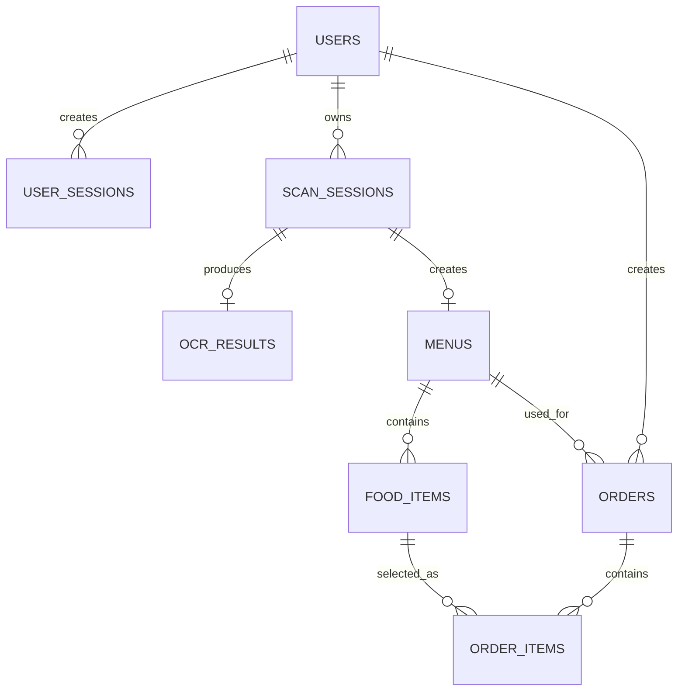
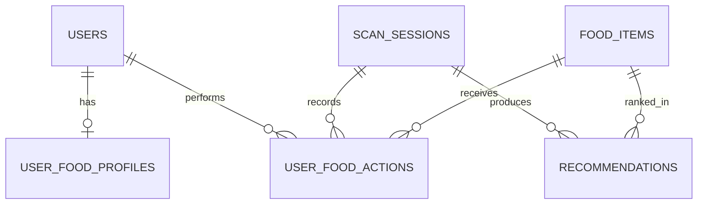

# Thiết kế cơ sở dữ liệu MenuScan

## 1. Mục đích và phạm vi

Tài liệu này mô tả các bảng dữ liệu cần lưu trong PostgreSQL cho MenuScan, dựa trên SRS, use case, class diagram, activity diagram, sequence diagram và system architecture trong thư mục `doc/`.

Thiết kế được chia thành hai phạm vi:

- **Phạm vi triển khai chính:** tài khoản, phiên đăng nhập, phiên quét, OCR, menu, món ăn, giỏ hàng/hóa đơn và tiến trình ingestion.
- **Phần bổ sung sau này:** hồ sơ ăn uống, hành vi người dùng và recommendation.

Trong phạm vi hiện tại, dữ liệu menu và món ăn được tạo tự động từ kết quả OCR/LLM. Người dùng có thể xem, lưu và xóa menu khỏi lịch sử nhưng **không có chức năng chỉnh sửa nội dung menu hoặc món ăn**.

Ảnh/PDF menu do người dùng upload được lưu trong **Object Storage**. PostgreSQL chỉ lưu URL hoặc object key của file menu gốc trong `scan_sessions.source_file_url`. Luồng hiện tại không tạo hoặc lưu ảnh riêng cho từng món ăn. Dữ liệu vector phục vụ RAG được lưu trong **Vector DB**, không lưu trực tiếp trong các bảng dưới đây.

## 2. Quy ước chung

- Hệ quản trị cơ sở dữ liệu: PostgreSQL 16.
- Tên bảng và cột dùng `snake_case`.
- Khóa chính dùng `UUID`, sinh bằng `gen_random_uuid()`.
- Thời gian dùng `TIMESTAMPTZ` và lưu theo UTC.
- Tiền tệ dùng `NUMERIC(14,2)`, không dùng kiểu số thực.
- Các cột `created_at` mặc định là `CURRENT_TIMESTAMP`.
- Khóa ngoại nên có index để tối ưu truy vấn.
- Mật khẩu và refresh token chỉ lưu bản băm, không lưu giá trị gốc.
- Xóa `users` hoặc `menus` nên dùng xóa mềm qua `deleted_at`. Dữ liệu phiên đăng nhập có thể xóa cứng khi hết hạn.

## 3. Tổng quan quan hệ

## 4. Các kiểu liệt kê

Có thể triển khai bằng PostgreSQL `ENUM` hoặc `VARCHAR` kết hợp `CHECK`.

| Kiểu               | Giá trị                                        |
| ------------------ | ---------------------------------------------- |
| `user_role`        | `TRAVELER`, `ADMIN`                            |
| `user_status`      | `ACTIVE`, `LOCKED`, `DISABLED`                 |
| `scan_status`      | `PENDING`, `PROCESSING`, `COMPLETED`, `FAILED` |
| `order_status`     | `DRAFT`, `GENERATED`, `CANCELLED`              |
| `ingestion_status` | `PENDING`, `PROCESSING`, `COMPLETED`, `FAILED` |

## 5. Các bảng MVP

### 5.1. Bảng `users`

**Mục đích:** Lưu tài khoản, quyền, trạng thái và tùy chọn ngôn ngữ của người dùng.

| Tên cột              | Kiểu dữ liệu   | Mô tả ý nghĩa                          | Ràng buộc                                 | Giá trị mẫu                            |
| -------------------- | -------------- | -------------------------------------- | ----------------------------------------- | -------------------------------------- |
| `id`                 | `UUID`         | Định danh người dùng                   | PK, NOT NULL, DEFAULT `gen_random_uuid()` | `550e8400-e29b-41d4-a716-446655440000` |
| `full_name`          | `VARCHAR(150)` | Họ tên hiển thị                        | NOT NULL                                  | `Nguyen Van An`                        |
| `email`              | `VARCHAR(255)` | Email đăng ký và đăng nhập             | NOT NULL, UNIQUE trên `LOWER(email)`      | `an.nguyen@example.com`                |
| `password_hash`      | `VARCHAR(255)` | Mật khẩu đã băm                        | NOT NULL                                  | `$argon2id$v=19$...`                   |
| `preferred_language` | `VARCHAR(10)`  | Ngôn ngữ người dùng muốn nhận bản dịch | NOT NULL, DEFAULT `'vi'`                  | `vi`                                   |
| `role`               | `user_role`    | Vai trò phân quyền                     | NOT NULL, DEFAULT `TRAVELER`              | `TRAVELER`                             |
| `status`             | `user_status`  | Trạng thái hoạt động của tài khoản     | NOT NULL, DEFAULT `ACTIVE`                | `ACTIVE`                               |
| `created_at`         | `TIMESTAMPTZ`  | Thời điểm tạo tài khoản                | NOT NULL, DEFAULT `CURRENT_TIMESTAMP`     | `2026-06-05T08:30:00Z`                 |
| `updated_at`         | `TIMESTAMPTZ`  | Thời điểm cập nhật gần nhất            | NOT NULL, DEFAULT `CURRENT_TIMESTAMP`     | `2026-06-05T09:00:00Z`                 |
| `deleted_at`         | `TIMESTAMPTZ`  | Thời điểm xóa mềm tài khoản            | NULL khi chưa xóa                         | `NULL`                                 |

**Index đề xuất:**

- Unique index `uq_users_email_lower` trên `LOWER(email)`.
- Index `idx_users_status` trên `status`.

### 5.2. Bảng `user_sessions`

**Mục đích:** Lưu phiên đăng nhập và refresh token đã băm để cấp lại access token hoặc thu hồi phiên.

| Tên cột              | Kiểu dữ liệu   | Mô tả ý nghĩa                       | Ràng buộc                                    | Giá trị mẫu                            |
| -------------------- | -------------- | ----------------------------------- | -------------------------------------------- | -------------------------------------- |
| `id`                 | `UUID`         | Định danh phiên đăng nhập           | PK, NOT NULL, DEFAULT `gen_random_uuid()`    | `54f39cc0-44ee-4e21-a107-9d5b3899a246` |
| `user_id`            | `UUID`         | Người dùng sở hữu phiên             | FK → `users.id`, NOT NULL, ON DELETE CASCADE | `550e8400-e29b-41d4-a716-446655440000` |
| `refresh_token_hash` | `VARCHAR(255)` | Refresh token đã băm                | NOT NULL, UNIQUE                             | `$argon2id$v=19$token...`              |
| `user_agent`         | `TEXT`         | Trình duyệt hoặc thiết bị đăng nhập | NULL                                         | `Mozilla/5.0 Chrome/136`               |
| `ip_address`         | `INET`         | Địa chỉ IP khi tạo phiên            | NULL                                         | `203.0.113.10`                         |
| `expires_at`         | `TIMESTAMPTZ`  | Thời điểm refresh token hết hạn     | NOT NULL                                     | `2026-07-05T08:30:00Z`                 |
| `revoked_at`         | `TIMESTAMPTZ`  | Thời điểm phiên bị thu hồi          | NULL khi còn hiệu lực                        | `NULL`                                 |
| `created_at`         | `TIMESTAMPTZ`  | Thời điểm đăng nhập                 | NOT NULL, DEFAULT `CURRENT_TIMESTAMP`        | `2026-06-05T08:30:00Z`                 |

**Index đề xuất:**

- Index `idx_user_sessions_user_id` trên `user_id`.
- Index `idx_user_sessions_expires_at` trên `expires_at`.

### 5.3. Bảng `scan_sessions`

**Mục đích:** Lưu một lần người dùng upload và xử lý ảnh/PDF menu, đồng thời là dữ liệu lịch sử quét.

Theo sequence diagram, chỉ lưu lịch sử vào PostgreSQL khi người dùng đã đăng nhập. Với khách, ảnh có thể được lưu tạm trong Object Storage nhưng không tạo bản ghi `scan_sessions`.

| Tên cột            | Kiểu dữ liệu   | Mô tả ý nghĩa                       | Ràng buộc                                     | Giá trị mẫu                            |
| ------------------ | -------------- | ----------------------------------- | --------------------------------------------- | -------------------------------------- |
| `id`               | `UUID`         | Định danh phiên quét                | PK, NOT NULL, DEFAULT `gen_random_uuid()`     | `71151f64-39c7-4419-810a-c0835bafe341` |
| `user_id`          | `UUID`         | Người dùng thực hiện quét           | FK → `users.id`, NOT NULL, ON DELETE RESTRICT | `550e8400-e29b-41d4-a716-446655440000` |
| `source_file_url`  | `TEXT`         | URL/object key của ảnh hoặc PDF gốc | NOT NULL                                      | `menus/2026/06/menu-001.jpg`           |
| `source_file_name` | `VARCHAR(255)` | Tên file do người dùng upload       | NOT NULL                                      | `menu-nha-hang.jpg`                    |
| `source_mime_type` | `VARCHAR(100)` | MIME type của file                  | NOT NULL, CHECK thuộc loại được hỗ trợ        | `image/jpeg`                           |
| `source_file_size` | `BIGINT`       | Kích thước file theo byte           | NOT NULL, CHECK `source_file_size > 0`        | `2458912`                              |
| `target_language`  | `VARCHAR(10)`  | Ngôn ngữ đích người dùng chọn       | NOT NULL                                      | `vi`                                   |
| `status`           | `scan_status`  | Trạng thái xử lý hiện tại           | NOT NULL, DEFAULT `PENDING`                   | `COMPLETED`                            |
| `failure_reason`   | `TEXT`         | Lý do xử lý thất bại                | NULL; chỉ có giá trị khi `status = FAILED`    | `Không thể đọc nội dung menu`          |
| `created_at`       | `TIMESTAMPTZ`  | Thời điểm bắt đầu phiên quét        | NOT NULL, DEFAULT `CURRENT_TIMESTAMP`         | `2026-06-05T08:35:00Z`                 |
| `completed_at`     | `TIMESTAMPTZ`  | Thời điểm xử lý hoàn tất            | NULL khi chưa hoàn tất                        | `2026-06-05T08:35:12Z`                 |
| `deleted_at`       | `TIMESTAMPTZ`  | Thời điểm người dùng xóa lịch sử    | NULL khi chưa xóa                             | `NULL`                                 |

**Ràng buộc bổ sung:**

- `completed_at >= created_at`.
- `failure_reason` phải khác `NULL` khi `status = FAILED`.
- MIME type MVP nên giới hạn ở `image/jpeg`, `image/png`, `image/webp` và `application/pdf`.

**Index đề xuất:**

- Index `idx_scan_sessions_user_created` trên `(user_id, created_at DESC)`.
- Index `idx_scan_sessions_status` trên `status`.

### 5.4. Bảng `ocr_results`

**Mục đích:** Lưu văn bản thô và metadata do OCR trích xuất từ file của một phiên quét.

| Tên cột             | Kiểu dữ liệu   | Mô tả ý nghĩa                                       | Ràng buộc                                                    | Giá trị mẫu                            |
| ------------------- | -------------- | --------------------------------------------------- | ------------------------------------------------------------ | -------------------------------------- |
| `id`                | `UUID`         | Định danh kết quả OCR                               | PK, NOT NULL, DEFAULT `gen_random_uuid()`                    | `7bfc07df-e8b0-43dd-bbdd-f10463ef6985` |
| `scan_session_id`   | `UUID`         | Phiên quét sinh ra kết quả                          | FK → `scan_sessions.id`, NOT NULL, UNIQUE, ON DELETE CASCADE | `71151f64-39c7-4419-810a-c0835bafe341` |
| `raw_text`          | `TEXT`         | Toàn bộ văn bản OCR chưa chuẩn hóa                  | NOT NULL                                                     | `Pho Bo 60.000 VND...`                 |
| `confidence_score`  | `NUMERIC(5,4)` | Độ tin cậy trung bình của OCR                       | NULL, CHECK từ `0` đến `1`                                   | `0.9475`                               |
| `detected_language` | `VARCHAR(10)`  | Ngôn ngữ nguồn được phát hiện                       | NULL                                                         | `vi`                                   |
| `provider`          | `VARCHAR(50)`  | Dịch vụ hoặc engine OCR đã dùng                     | NULL                                                         | `tesseract`                            |
| `provider_metadata` | `JSONB`        | Metadata kỹ thuật như block, trang hoặc token usage | NOT NULL, DEFAULT `'{}'::jsonb`                              | `{"page_count": 2}`                    |
| `created_at`        | `TIMESTAMPTZ`  | Thời điểm tạo kết quả OCR                           | NOT NULL, DEFAULT `CURRENT_TIMESTAMP`                        | `2026-06-05T08:35:07Z`                 |

### 5.5. Bảng `menus`

**Mục đích:** Lưu menu có cấu trúc được tạo tự động từ kết quả OCR/LLM để người dùng xem lại trong lịch sử. Nội dung menu không được chỉnh sửa thủ công.

| Tên cột            | Kiểu dữ liệu   | Mô tả ý nghĩa                            | Ràng buộc                                                    | Giá trị mẫu                            |
| ------------------ | -------------- | ---------------------------------------- | ------------------------------------------------------------ | -------------------------------------- |
| `id`               | `UUID`         | Định danh menu                           | PK, NOT NULL, DEFAULT `gen_random_uuid()`                    | `d837618b-c842-4778-b0bb-d1178dcff634` |
| `scan_session_id`  | `UUID`         | Phiên quét tạo ra menu                   | FK → `scan_sessions.id`, NOT NULL, UNIQUE, ON DELETE CASCADE | `71151f64-39c7-4419-810a-c0835bafe341` |
| `title`            | `VARCHAR(255)` | Tên menu để hiển thị và quản lý          | NOT NULL                                                     | `Menu Nha hang Hoa Sen`                |
| `source_language`  | `VARCHAR(10)`  | Ngôn ngữ gốc của menu                    | NULL nếu chưa nhận diện được                                 | `vi`                                   |
| `target_language`  | `VARCHAR(10)`  | Ngôn ngữ bản dịch                        | NOT NULL                                                     | `en`                                   |
| `default_currency` | `CHAR(3)`      | Mã tiền tệ mặc định theo ISO 4217        | NULL                                                         | `VND`                                  |
| `is_saved`         | `BOOLEAN`      | Người dùng đã xác nhận lưu menu hay chưa | NOT NULL, DEFAULT `FALSE`                                    | `true`                                 |
| `created_at`       | `TIMESTAMPTZ`  | Thời điểm tạo menu có cấu trúc           | NOT NULL, DEFAULT `CURRENT_TIMESTAMP`                        | `2026-06-05T08:35:10Z`                 |
| `deleted_at`       | `TIMESTAMPTZ`  | Thời điểm xóa mềm menu                   | NULL khi chưa xóa                                            | `NULL`                                 |

**Index đề xuất:**

- Index `idx_menus_title_search` dùng `GIN` với `to_tsvector(...)` nếu cần tìm kiếm full-text.

### 5.6. Bảng `food_items`

**Mục đích:** Lưu từng món ăn được hệ thống trích xuất từ menu, bao gồm nội dung gốc, bản dịch và giá. Dữ liệu món ăn không được chỉnh sửa thủ công.

| Tên cột                  | Kiểu dữ liệu    | Mô tả ý nghĩa                            | Ràng buộc                                      | Giá trị mẫu                            |
| ------------------------ | --------------- | ---------------------------------------- | ---------------------------------------------- | -------------------------------------- |
| `id`                     | `UUID`          | Định danh món ăn                         | PK, NOT NULL, DEFAULT `gen_random_uuid()`      | `a2f20df8-5570-411d-aad6-59308a295f65` |
| `menu_id`                | `UUID`          | Menu chứa món ăn                         | FK → `menus.id`, NOT NULL, ON DELETE CASCADE   | `d837618b-c842-4778-b0bb-d1178dcff634` |
| `original_name`          | `VARCHAR(255)`  | Tên món theo ngôn ngữ gốc                | NOT NULL                                       | `Pho bo`                               |
| `translated_name`        | `VARCHAR(255)`  | Tên món đã dịch                          | NULL khi chưa dịch                             | `Beef noodle soup`                     |
| `original_description`   | `TEXT`          | Mô tả món theo menu gốc                  | NULL                                           | `Pho voi thit bo tai`                  |
| `translated_description` | `TEXT`          | Mô tả món đã dịch                        | NULL                                           | `Rice noodles with rare beef`          |
| `price`                  | `NUMERIC(14,2)` | Giá món đã chuẩn hóa                     | NULL, CHECK `price >= 0`                       | `60000.00`                             |
| `currency`               | `CHAR(3)`       | Mã tiền tệ ISO 4217                      | NULL                                           | `VND`                                  |
| `category`               | `VARCHAR(100)`  | Nhóm món dùng để hiển thị và tìm kiếm    | NULL                                           | `Noodle soup`                          |
| `allergen_warnings`      | `JSONB`         | Danh sách cảnh báo dị ứng được phân tích | NOT NULL, DEFAULT `'[]'::jsonb`                | `["soy", "fish_sauce"]`                |
| `sort_order`             | `INTEGER`       | Vị trí món trong menu                    | NOT NULL, DEFAULT `0`, CHECK `sort_order >= 0` | `3`                                    |
| `created_at`             | `TIMESTAMPTZ`   | Thời điểm tạo món                        | NOT NULL, DEFAULT `CURRENT_TIMESTAMP`          | `2026-06-05T08:35:10Z`                 |

**Ràng buộc và index đề xuất:**

- UNIQUE `(menu_id, sort_order)`.
- Index `idx_food_items_menu_id` trên `menu_id`.
- GIN full-text index trên tên, mô tả và danh mục để hỗ trợ chức năng tìm kiếm.

## 6. Các bảng giỏ hàng và hóa đơn

### 6.1. Bảng `orders`

**Mục đích:** Lưu giỏ món tạm thời và hóa đơn được tạo từ một menu theo Order/Bill Module trong system architecture.

| Tên cột             | Kiểu dữ liệu    | Mô tả ý nghĩa               | Ràng buộc                                             | Giá trị mẫu                            |
| ------------------- | --------------- | --------------------------- | ----------------------------------------------------- | -------------------------------------- |
| `id`                | `UUID`          | Định danh giỏ hàng/hóa đơn  | PK, NOT NULL, DEFAULT `gen_random_uuid()`             | `93c2f564-2bb4-4330-a9a6-616dcc724832` |
| `user_id`           | `UUID`          | Người tạo giỏ hàng          | FK → `users.id`, NOT NULL, ON DELETE RESTRICT         | `550e8400-e29b-41d4-a716-446655440000` |
| `menu_id`           | `UUID`          | Menu được dùng để chọn món  | FK → `menus.id`, NOT NULL, ON DELETE RESTRICT         | `d837618b-c842-4778-b0bb-d1178dcff634` |
| `status`            | `order_status`  | Trạng thái giỏ hàng/hóa đơn | NOT NULL, DEFAULT `DRAFT`                             | `GENERATED`                            |
| `currency`          | `CHAR(3)`       | Tiền tệ của hóa đơn         | NOT NULL                                              | `VND`                                  |
| `subtotal`          | `NUMERIC(14,2)` | Tổng tiền trước phụ phí     | NOT NULL, DEFAULT `0`, CHECK `subtotal >= 0`          | `180000.00`                            |
| `additional_charge` | `NUMERIC(14,2)` | Thuế hoặc phụ phí nhập thêm | NOT NULL, DEFAULT `0`, CHECK `additional_charge >= 0` | `10000.00`                             |
| `total_amount`      | `NUMERIC(14,2)` | Tổng tiền cuối cùng         | NOT NULL, DEFAULT `0`, CHECK `total_amount >= 0`      | `190000.00`                            |
| `note`              | `TEXT`          | Ghi chú chung cho hóa đơn   | NULL                                                  | `Khong hanh`                           |
| `generated_at`      | `TIMESTAMPTZ`   | Thời điểm chốt hóa đơn      | NULL; có giá trị khi `status = GENERATED`             | `2026-06-05T09:00:00Z`                 |
| `created_at`        | `TIMESTAMPTZ`   | Thời điểm tạo giỏ hàng      | NOT NULL, DEFAULT `CURRENT_TIMESTAMP`                 | `2026-06-05T08:45:00Z`                 |
| `updated_at`        | `TIMESTAMPTZ`   | Thời điểm cập nhật gần nhất | NOT NULL, DEFAULT `CURRENT_TIMESTAMP`                 | `2026-06-05T09:00:00Z`                 |

### 6.2. Bảng `order_items`

**Mục đích:** Lưu từng món, số lượng, đơn giá và ghi chú trong một giỏ hàng/hóa đơn.

| Tên cột        | Kiểu dữ liệu    | Mô tả ý nghĩa                             | Ràng buộc                                          | Giá trị mẫu                            |
| -------------- | --------------- | ----------------------------------------- | -------------------------------------------------- | -------------------------------------- |
| `id`           | `UUID`          | Định danh dòng hóa đơn                    | PK, NOT NULL, DEFAULT `gen_random_uuid()`          | `01fdbdb8-4f71-4bca-893a-8f82237976e1` |
| `order_id`     | `UUID`          | Hóa đơn chứa dòng món                     | FK → `orders.id`, NOT NULL, ON DELETE CASCADE      | `93c2f564-2bb4-4330-a9a6-616dcc724832` |
| `food_item_id` | `UUID`          | Món ăn được chọn                          | FK → `food_items.id`, NOT NULL, ON DELETE RESTRICT | `a2f20df8-5570-411d-aad6-59308a295f65` |
| `item_name`    | `VARCHAR(255)`  | Bản chụp tên món tại lúc thêm vào hóa đơn | NOT NULL                                           | `Pho bo`                               |
| `quantity`     | `INTEGER`       | Số lượng món                              | NOT NULL, CHECK `quantity > 0`                     | `2`                                    |
| `unit_price`   | `NUMERIC(14,2)` | Đơn giá tại lúc thêm món                  | NOT NULL, CHECK `unit_price >= 0`                  | `60000.00`                             |
| `line_total`   | `NUMERIC(14,2)` | Thành tiền của dòng món                   | NOT NULL, CHECK `line_total >= 0`                  | `120000.00`                            |
| `note`         | `TEXT`          | Ghi chú riêng cho món                     | NULL                                               | `It cay`                               |
| `created_at`   | `TIMESTAMPTZ`   | Thời điểm thêm món                        | NOT NULL, DEFAULT `CURRENT_TIMESTAMP`              | `2026-06-05T08:46:00Z`                 |
| `updated_at`   | `TIMESTAMPTZ`   | Thời điểm cập nhật dòng món               | NOT NULL, DEFAULT `CURRENT_TIMESTAMP`              | `2026-06-05T08:50:00Z`                 |

**Ràng buộc bổ sung:**

- UNIQUE `(order_id, food_item_id)` nếu mỗi món chỉ xuất hiện một dòng.
- `line_total = quantity * unit_price`; nên tính và kiểm tra trong service hoặc generated column.

## 7. Bảng ingestion và giám sát

### 7.1. Bảng `ingestion_jobs`

**Mục đích:** Theo dõi tiến trình đưa dữ liệu ẩm thực vào RAG/Vector DB và hỗ trợ Admin giám sát, retry khi có lỗi.

| Tên cột             | Kiểu dữ liệu       | Mô tả ý nghĩa                    | Ràng buộc                                             | Giá trị mẫu                            |
| ------------------- | ------------------ | -------------------------------- | ----------------------------------------------------- | -------------------------------------- |
| `id`                | `UUID`             | Định danh tiến trình ingestion   | PK, NOT NULL, DEFAULT `gen_random_uuid()`             | `ca48c187-d158-41d3-a950-e8348a7db76a` |
| `created_by`        | `UUID`             | Admin tạo tiến trình             | FK → `users.id`, NULL, ON DELETE SET NULL             | `550e8400-e29b-41d4-a716-446655440000` |
| `source_type`       | `VARCHAR(50)`      | Loại nguồn dữ liệu               | NOT NULL                                              | `JSON_FILE`                            |
| `source_uri`        | `TEXT`             | URL/object key của nguồn đầu vào | NOT NULL                                              | `ingestion/cuisine-knowledge-v1.json`  |
| `status`            | `ingestion_status` | Trạng thái xử lý                 | NOT NULL, DEFAULT `PENDING`                           | `COMPLETED`                            |
| `records_total`     | `INTEGER`          | Tổng số bản ghi đầu vào          | NOT NULL, DEFAULT `0`, CHECK `records_total >= 0`     | `1250`                                 |
| `records_processed` | `INTEGER`          | Số bản ghi đã xử lý              | NOT NULL, DEFAULT `0`, CHECK `records_processed >= 0` | `1250`                                 |
| `retry_count`       | `INTEGER`          | Số lần chạy lại                  | NOT NULL, DEFAULT `0`, CHECK `retry_count >= 0`       | `1`                                    |
| `error_message`     | `TEXT`             | Lỗi gần nhất của tiến trình      | NULL khi không có lỗi                                 | `NULL`                                 |
| `started_at`        | `TIMESTAMPTZ`      | Thời điểm bắt đầu xử lý          | NULL                                                  | `2026-06-05T01:00:00Z`                 |
| `completed_at`      | `TIMESTAMPTZ`      | Thời điểm hoàn tất               | NULL                                                  | `2026-06-05T01:04:20Z`                 |
| `created_at`        | `TIMESTAMPTZ`      | Thời điểm tạo tiến trình         | NOT NULL, DEFAULT `CURRENT_TIMESTAMP`                 | `2026-06-05T00:59:00Z`                 |

**Ràng buộc bổ sung:**

- `records_processed <= records_total`.
- `completed_at >= started_at`.

## 8. Quy tắc toàn vẹn dữ liệu

1. Một `scan_session` có tối đa một `ocr_result` và một `menu`.
2. Một `menu` có nhiều `food_items`; xóa cứng menu sẽ xóa các món thuộc menu.
3. Chỉ người dùng đã đăng nhập mới có lịch sử trong `scan_sessions`.
4. Access token không lưu trong database; chỉ lưu hash của refresh token trong `user_sessions`.
5. Menu và món ăn là kết quả chỉ đọc do hệ thống tạo ra; không cung cấp API cập nhật nội dung menu hoặc `food_items`.
6. File upload là ảnh/PDF của toàn bộ menu và chỉ liên kết với `scan_sessions`; hệ thống hiện không cắt ảnh menu thành ảnh từng món, không tìm ảnh bên ngoài và không sinh ảnh món bằng AI.
7. `order_items.unit_price` là bản chụp giá tại thời điểm tạo hóa đơn để lịch sử không phụ thuộc vào dữ liệu nguồn.
8. Xóa người dùng phải thu hồi toàn bộ `user_sessions`. Dữ liệu nghiệp vụ cần giữ để audit nên ẩn danh thay vì xóa nếu dự án bổ sung yêu cầu pháp lý.
9. Các trường JSONB phải lưu mảng/object JSON hợp lệ; service nên chuẩn hóa giá trị về chữ thường để tránh trùng lặp.

## 9. Thứ tự triển khai đề xuất

1. MVP đợt 1: `users`, `user_sessions`.
2. MVP đợt 2: `scan_sessions`, `ocr_results`, `menus`, `food_items`.
3. Order/Bill: `orders`, `order_items`.
4. Admin/RAG: `ingestion_jobs`.

## 10. Phần bổ sung sau này: Recommendation

> Phần này không thuộc schema triển khai chính và chưa cần tạo migration. Chỉ sử dụng khi dự án bắt đầu phát triển chức năng recommendation.

Recommendation cần lưu ba nhóm dữ liệu: hồ sơ ăn uống tổng hợp, hành vi của người dùng đối với món ăn và kết quả xếp hạng món theo từng phiên quét.

Kiểu liệt kê bổ sung:

| Kiểu               | Giá trị                                     |
| ------------------ | ------------------------------------------- |
| `food_action_type` | `SELECTED`, `SKIPPED`, `DISLIKED`, `UNSAFE` |

Quan hệ dữ liệu dự kiến:

### 10.1. Bảng `user_food_profiles`

**Mục đích:** Lưu hồ sơ ăn uống tổng hợp của người dùng để cá nhân hóa và xếp hạng món ăn trong giai đoạn sau.

| Tên cột                | Kiểu dữ liệu  | Mô tả ý nghĩa                         | Ràng buộc                                            | Giá trị mẫu                            |
| ---------------------- | ------------- | ------------------------------------- | ---------------------------------------------------- | -------------------------------------- |
| `id`                   | `UUID`        | Định danh hồ sơ                       | PK, NOT NULL, DEFAULT `gen_random_uuid()`            | `a589e741-3fc8-4937-b30b-6151a7360e02` |
| `user_id`              | `UUID`        | Người dùng sở hữu hồ sơ               | FK → `users.id`, NOT NULL, UNIQUE, ON DELETE CASCADE | `550e8400-e29b-41d4-a716-446655440000` |
| `preferences`          | `JSONB`       | Sở thích hoặc món thường chọn         | NOT NULL, DEFAULT `'[]'::jsonb`                      | `["spicy", "noodles"]`                 |
| `allergies`            | `JSONB`       | Thành phần gây dị ứng cần cảnh báo    | NOT NULL, DEFAULT `'[]'::jsonb`                      | `["peanut", "shellfish"]`              |
| `disliked_foods`       | `JSONB`       | Món hoặc nguyên liệu không thích      | NOT NULL, DEFAULT `'[]'::jsonb`                      | `["cilantro"]`                         |
| `dietary_restrictions` | `JSONB`       | Chế độ ăn hoặc giới hạn ăn uống       | NOT NULL, DEFAULT `'[]'::jsonb`                      | `["vegetarian"]`                       |
| `profile_version`      | `INTEGER`     | Phiên bản hồ sơ                       | NOT NULL, DEFAULT `1`, CHECK `profile_version > 0`   | `4`                                    |
| `last_analyzed_at`     | `TIMESTAMPTZ` | Lần background job phân tích gần nhất | NULL                                                 | `2026-06-05T03:00:00Z`                 |
| `created_at`           | `TIMESTAMPTZ` | Thời điểm tạo hồ sơ                   | NOT NULL, DEFAULT `CURRENT_TIMESTAMP`                | `2026-05-20T10:00:00Z`                 |
| `updated_at`           | `TIMESTAMPTZ` | Thời điểm cập nhật hồ sơ              | NOT NULL, DEFAULT `CURRENT_TIMESTAMP`                | `2026-06-05T03:00:00Z`                 |

### 10.2. Bảng `user_food_actions`

**Mục đích:** Lưu hành vi chọn, bỏ qua, không thích hoặc đánh dấu không ăn được để làm đầu vào cập nhật hồ sơ ăn uống.

| Tên cột           | Kiểu dữ liệu       | Mô tả ý nghĩa                            | Ràng buộc                                         | Giá trị mẫu                            |
| ----------------- | ------------------ | ---------------------------------------- | ------------------------------------------------- | -------------------------------------- |
| `id`              | `UUID`             | Định danh hành vi                        | PK, NOT NULL, DEFAULT `gen_random_uuid()`         | `4292f83e-7ca2-42ae-bd52-b27b0e57217a` |
| `user_id`         | `UUID`             | Người thực hiện hành vi                  | FK → `users.id`, NOT NULL, ON DELETE CASCADE      | `550e8400-e29b-41d4-a716-446655440000` |
| `scan_session_id` | `UUID`             | Phiên quét nơi hành vi xảy ra            | FK → `scan_sessions.id`, NULL, ON DELETE SET NULL | `71151f64-39c7-4419-810a-c0835bafe341` |
| `food_item_id`    | `UUID`             | Món ăn nhận hành vi                      | FK → `food_items.id`, NULL, ON DELETE SET NULL    | `a2f20df8-5570-411d-aad6-59308a295f65` |
| `action_type`     | `food_action_type` | Loại hành vi                             | NOT NULL                                          | `SELECTED`                             |
| `action_metadata` | `JSONB`            | Thông tin bổ sung tại thời điểm ghi nhận | NOT NULL, DEFAULT `'{}'::jsonb`                   | `{"source": "food_card"}`              |
| `created_at`      | `TIMESTAMPTZ`      | Thời điểm hành vi xảy ra                 | NOT NULL, DEFAULT `CURRENT_TIMESTAMP`             | `2026-06-05T08:37:00Z`                 |

### 10.3. Bảng `recommendations`

**Mục đích:** Lưu kết quả xếp hạng món cho một phiên quét để hiển thị lại và giải thích lý do gợi ý.

| Tên cột           | Kiểu dữ liệu   | Mô tả ý nghĩa                    | Ràng buộc                                            | Giá trị mẫu                            |
| ----------------- | -------------- | -------------------------------- | ---------------------------------------------------- | -------------------------------------- |
| `id`              | `UUID`         | Định danh gợi ý                  | PK, NOT NULL, DEFAULT `gen_random_uuid()`            | `ff4cd3f3-f265-417e-93d6-2cb0882b9a71` |
| `scan_session_id` | `UUID`         | Phiên quét sinh ra gợi ý         | FK → `scan_sessions.id`, NOT NULL, ON DELETE CASCADE | `71151f64-39c7-4419-810a-c0835bafe341` |
| `food_item_id`    | `UUID`         | Món ăn được gợi ý                | FK → `food_items.id`, NOT NULL, ON DELETE CASCADE    | `a2f20df8-5570-411d-aad6-59308a295f65` |
| `rank`            | `INTEGER`      | Thứ hạng trong danh sách gợi ý   | NOT NULL, CHECK `rank > 0`                           | `1`                                    |
| `score`           | `NUMERIC(6,5)` | Điểm phù hợp đã chuẩn hóa        | NULL, CHECK từ `0` đến `1`                           | `0.92350`                              |
| `reason`          | `TEXT`         | Giải thích ngắn cho người dùng   | NULL                                                 | `Phù hợp sở thích món cay`             |
| `warning`         | `TEXT`         | Cảnh báo cần hiển thị cùng gợi ý | NULL                                                 | `Có thể chứa nước mắm`                 |
| `model_version`   | `VARCHAR(100)` | Phiên bản thuật toán xếp hạng    | NULL                                                 | `recommend-v1`                         |
| `created_at`      | `TIMESTAMPTZ`  | Thời điểm tạo gợi ý              | NOT NULL, DEFAULT `CURRENT_TIMESTAMP`                | `2026-06-05T08:35:11Z`                 |

**Ràng buộc và index dự kiến:**

- UNIQUE `(scan_session_id, food_item_id)`.
- UNIQUE `(scan_session_id, rank)`.
- Index `idx_food_actions_user_created` trên `(user_id, created_at DESC)`.
- Index `idx_food_actions_type` trên `action_type`.
